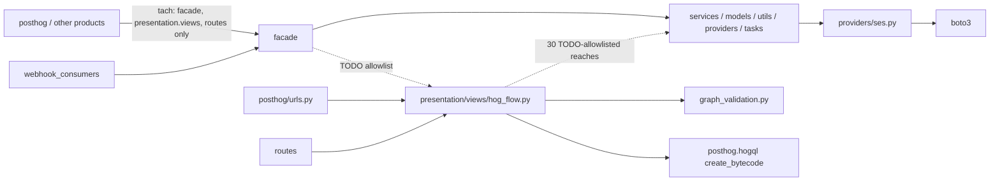

## 1. Engineer (0 s)

/define-invariant products/workflows/backend

## 2. Skill (84.2 s)

## Scope: `products/workflows/backend`

This is the workflows product's Django backend (about 115 modules). `presentation/views/hog_flow.py` holds the `HogFlowSerializer` and viewsets (about 6k lines). Around it sit `services/`, `models/`, `providers/` (SES, Twilio, maildev), `tasks/`, `utils/`, `management/commands/`, and the `facade/` that the rest of PostHog uses. There is no `*.spec.md` in or above the folder yet.



**Enforcers that cover the folder**
| Enforcer | What it owns here |
|---|---|
| tach (`tach.toml:1096`, interface `:1120`) | What workflows may depend on (cohorts, cdp, messaging, signals, tasks, …). Outsiders may import only `backend.facade.*`, `backend.presentation.views.*` and `backend.routes.*` |
| import-linter (`pyproject.toml`) | Four `products.*.backend` contracts: presentation reaches only the facade (30 workflows TODO exemptions at `:727`), routes reach only presentation, webhook_consumers reach only the facade, and the facade must not import presentation or DRF (1 workflows exemption at `:891`) |
| ruff (`products/ruff.toml` → `pyproject.toml`) | General lint plus ANN. `TID251` is **not selected**, and no config sits between `products/` and this folder |
| oxlint | Doesn't apply: the folder is Python only |

**Evidence.** The harvest has 30 rules for workflows, plus 6 corrections in this folder. Most rules are semantic (serializer checks, stamps, idempotency), so an import rule can't express them. `facade-is-the-only-way-in` is already owned by tach, so it's out. Three rules are backed and have an import shape:

1. `graph-structure-validated-on-every-write`: `graph_validation.py` has exactly one non-test importer, `hog_flow.py`.
2. `server-compiles-all-bytecode`: in this folder, `create_bytecode` is imported only in `hog_flow.py`.
3. The `providers/ses.py` corrections (#89643) and the facade comment at `facade/api.py:249`: `boto3` is imported only in `providers/ses.py`.

I'll take them one at a time.

**Q1: Graph validation has one door**
Sentence: *Only `presentation/views/hog_flow.py` imports `presentation/views/graph_validation.py`.*
because: every graph write goes through the serializer, so the validator runs on the API, the editor and MCP alike. A second importer would mean a second write path that could skip or fork the check.
Form: chokepoint (module), `protects: graph_validation.py`, `chokepoint: hog_flow.py`. It has 0 violations today; only tests import it besides `hog_flow.py`. import-linter's "presentation must use facade" names the parent `products.*.backend`, so Coherence should grade it `checker-choked`. That contract only limits what presentation imports, though. It would not stop `services/` or `facade/` from importing the validator, and the `because` will say so.

**Recommendation:** Accept. It's backed by a harvested rule, the code already has this shape, nothing needs fixing, and you get an enforcer credit for free.

<details><summary>11 commands</summary>

```sh
cd /tmp/dogfood-119-py/posthog; S=/home/coder/dev/uml-pr-review/.claude/worktrees/agent-a3625518b9e8e6f40/skills/define-invariant; ls $S; cat $S/enforcers.md; echo ---; cat coherence.config.json; echo ---; echo COHERENCE_HOME=$COHERENCE_HOME; which coherence; echo ---; find products/workflows -name '*.spec.md' -not -path '*/node_modules/*'; ls products/*.spec.md products/workflows/*.spec.md 2>/dev/null; echo ---; ls products/workflows/backend; find products/workflows/backend -name '*.py' | grep -v test | wc -l
```
```sh
cd /tmp/dogfood-119-py/posthog; find products/workflows/backend -name '*.py' -not -path '*/migrations/*' -not -path '*test*' | sort; echo ---TACH; grep -n -B2 -A12 'products.workflows' tach.toml | head -80; echo ---IL; grep -n -A25 'tool.importlinter' pyproject.toml | head -150
```
```sh
cd /tmp/dogfood-119-py/posthog; cat products/ruff.toml | head -60; echo ---; grep -n 'TID\|banned-api\|extend-select\|^select' pyproject.toml | head; ls products/workflows/backend/facade products/workflows/backend/presentation products/workflows/backend/services products/workflows/backend/providers products/workflows/backend/utils products/workflows/backend/models products/workflows/backend/tasks
```
```sh
cd /tmp/dogfood-119-py/posthog; grep -n -A12 'path = "products.workflows"' tach.toml; grep -n -B3 -A8 'workflows' tach.toml | grep -n -i 'interface\|expose\|from =' | head; awk '/\[\[interfaces\]\]/{p=1} p' tach.toml | head -40; echo ---; grep -n 'workflows' pyproject.toml; echo ---; grep -rn 'reportPrivateUsage' pyproject.toml pyrightconfig.json 2>/dev/null
```
```sh
cd /tmp/dogfood-119-py/posthog; sed -n 1108,1160p tach.toml; sed -n 720,731p pyproject.toml; ls pyrightconfig.json 2>/dev/null; grep -n 'pyright' pyproject.toml | head -3
```
```sh
R=/home/coder/dev/uml-pr-review/.claude/worktrees/agent-a3625518b9e8e6f40; cd $R; F=products/workflows/backend; echo LABELS; jq -c "select(.path | startswith(\"$F\")) | {path,catchable,ruleKind,ruleSketch,quote}" docs/lintability/labels.jsonl | head -60; echo; echo COUNT $(jq -c "select(.path | startswith(\"products/workflows\"))" docs/lintability/labels.jsonl | wc -l); echo CORPUS $(jq -c "select(.path | startswith(\"$F\"))" docs/corrections/corpus.jsonl | wc -l); ls docs/harvest/
```
```sh
R=/home/coder/dev/uml-pr-review/.claude/worktrees/agent-a3625518b9e8e6f40; cd $R; jq -c 'select(.path | startswith("products/workflows")) | {path,catchable,ruleKind,ruleSketch,quote}' docs/lintability/labels.jsonl; echo; jq -c 'select(.path | startswith("products/workflows/backend"))' docs/corrections/corpus.jsonl | cut -c1-600; echo; ls docs/harvest/workflows; jq -r '.rules[] | "\(.id): \(.statement)"' docs/harvest/workflows/rules.json
```
```sh
cd /tmp/dogfood-119-py/posthog; python3 - <<'EOF'
import os,re,subprocess
base='products/workflows/backend'
mods=[]
for root,_,fs in os.walk(base):
    if 'migrations' in root or '/test' in root: continue
    for f in fs:
        if f.endswith('.py') and not f.startswith('test_'):
            p=os.path.join(root,f); m=p[:-3].replace('/','.')
            if m.endswith('.__init__'): m=m[:-9]
            mods.append((m,p))
out=subprocess.run(['rg','-l','--type','py','-g','!**/migrations/**','products.workflows.backend','.'],capture_output=True,text=True).stdout.split()
src={f:open(f).read() for f in out}
for m,p in sorted(mods):
    parent,_,leaf=m.rpartition('.')
    pat=re.compile(r'(from\s+%s\s+import\s+[^\n]*\b%s\b|from\s+%s(\s|\.)|import\s+%s\b)'%(re.escape(parent),leaf,re.escape(m),re.escape(m)))
    imps=[f[2:] for f,s in src.items() if pat.search(s) and f[2:]!=p]
    prod=[i for i in imps if '/test' not in i and 'test_' not in i.split('/')[-1]]
    if len(prod)<=1: print(len(prod),len(imps),m,prod)
EOF
```
```sh
cd /tmp/dogfood-119-py/posthog; python3 - <<'EOF'
import os,re,subprocess
base='products/workflows/backend'
mods=[]
for root,_,fs in os.walk(base):
    if 'migrations' in root or '/test' in root: continue
    for f in fs:
        if f.endswith('.py') and not f.startswith('test_'):
            p=os.path.join(root,f); m=p[:-3].replace('/','.')
            if m.endswith('.__init__'): m=m[:-9]
            mods.append((m,p))
out=subprocess.run(['git','grep','-l','products.workflows.backend','--','*.py',':!**/migrations/**'],capture_output=True,text=True).stdout.split()
src={f:open(f).read() for f in out}
for m,p in sorted(mods):
    parent,_,leaf=m.rpartition('.')
    pat=re.compile(r'(from\s+%s\s+import\s+[^\n]*\b%s\b|from\s+%s(\s|\.)|import\s+%s\b)'%(re.escape(parent),leaf,re.escape(m),re.escape(m)))
    imps=[f for f,s in src.items() if pat.search(s) and f!=p]
    prod=[i for i in imps if '/test' not in i and not i.split('/')[-1].startswith('test_')]
    if len(prod)<=1: print(len(prod),len(imps),m,prod)
EOF
```
```sh
cd /tmp/dogfood-119-py/posthog; B=products/workflows/backend; echo BOTO; git grep -n 'boto3\|botocore' -- $B ':!*test*' | cut -c1-160; echo COMPILE; git grep -n 'compile_hog\|create_bytecode\|compile_filters_bytecode\|hog_function_filters_to_expr' -- $B ':!*test*' | cut -c1-170; echo DUR; git grep -n 'utils.durations\|import durations' -- . ':!*test*' | cut -c1-170; echo SECRET; git grep -n 'def .*secret\|_strip_secret\|mask_secret' -- $B ':!*test*' | cut -c1-170; echo GRAPH; git grep -n 'graph_validation\|validate_graph' -- . ':!*test*' | cut -c1-170
```
```sh
cd /tmp/dogfood-119-py/posthog; git ls-files '**/ruff.toml' '**/.ruff.toml'; echo; git grep -l 'create_bytecode' -- '*.py' ':!*test*' | wc -l; git grep -l '^import boto3\|^from boto3\|^    import boto3' -- '*.py' ':!*test*' | wc -l; sed -n 370,400p pyproject.toml; node $COHERENCE_HOME/src/cli.ts --help 2>&1 | head -40
```

</details>

## 3. Engineer (2.8 s)

Yes, accept it. The single serializer path for graph writes is intentional, and the `because` should note that the import-linter contract doesn't cover `services/` or `facade/`.

## 4. Skill (23.2 s)

The probe worked. A nested `products/workflows/backend/ruff.toml` with `extend = "../../ruff.toml"` scopes `TID251` to this folder only. The inherited `products/ruff.toml` settings, including the ANN test ignores, still apply. I deleted the probe file afterwards.

**Q2: Only the serializer compiles bytecode**
Sentence: *Under `products/workflows/backend`, only `presentation/views/hog_flow.py` imports a bytecode compiler (`create_bytecode`, `compile_filters_expr`, `generate_template_bytecode`).*
because: this is the harvested rule `server-compiles-all-bytecode`. Every write path discards client bytecode and recompiles in the serializer, so a compiler call elsewhere is a second path that can drift or trust client input.
Form: a lint totality oracle, `via: lint ruff:TID251 matching "server-compiles-all-bytecode"`. It needs a new nested `ruff.toml` in the folder that bans those three symbols. `hog_flow.py` and `test/**` get a `per-file-ignores` exemption, as the paved path and the tests, not as a residual. There are 0 other violations today.

**Recommendation:** Accept. It's backed by a harvested rule, it's clean today, and the nested config keeps the ban out of the rest of the repo.

<details><summary>3 commands</summary>

```sh
cd /tmp/dogfood-119-py/posthog; git grep -n 'create_bytecode\|import boto3\|from boto3\|from botocore' -- products/workflows ':!*.ts*' | cut -c1-150; echo; git grep -n 'banned-api\|TID251' -- '*.toml' | head; echo; U=/home/coder/.local/bin/uvx; time $U ruff@0.15.20 check --force-exclude --output-format concise products/workflows/backend 2>&1 | tail -3
```
```sh
cd /tmp/dogfood-119-py/posthog; grep -n '^from.*\(bytecode\|compile\)\|^    .*compile.*,$' products/workflows/backend/presentation/views/hog_flow.py | head; git grep -n 'compile_hog\|compile_filters\|generate_template_bytecode\|compile_expr' -- products/workflows/backend ':!*test*' | cut -c1-160 | head
```
```sh
cd /tmp/dogfood-119-py/posthog; F=products/workflows/backend/ruff.toml; cat > $F <<'EOF'
extend = "../../ruff.toml"
[lint]
extend-select = ["TID251"]
[lint.flake8-tidy-imports.banned-api]
"posthog.hogql.compiler.bytecode.create_bytecode".msg = "probe"
EOF
U=/home/coder/.local/bin/uvx; $U ruff@0.15.20 check --force-exclude --output-format concise products/workflows/backend 2>&1 | tail -8; echo ---; $U ruff@0.15.20 check --force-exclude --output-format concise products/workflows/backend --select ANN 2>&1 | tail -2; rm $F; git status --short products/
```

</details>

## 5. Engineer (2.7 s)

Yes, go ahead. The nested ruff.toml is scoped to our folder, so it doesn't add overhead for anyone else, and a single recompile path in the serializer is how we intend it to work.

## 6. Skill (11.8 s)

**Q3: AWS SES is reached only through `SESProvider`**
Sentence: *Under `products/workflows/backend`, only `providers/ses.py` imports `boto3` or `botocore`. Everything else calls `SESProvider`.*
because: the provider owns client config (timeouts, retries), typed stubs and error mapping. Reviewers pushed that into `ses.py` in #89643, and `facade/api.py:249` deliberately keeps boto3 off the facade import path.
Form: a lint totality oracle in the same nested `ruff.toml`, `via: lint ruff:TID251 matching "ses-only-through-provider"`. It bans the `boto3` and `botocore` modules, with `providers/ses.py` and `test/**` exempt. There are 0 violations today, and the four other SES callers all go through `SESProvider` already.
Backing: the code's shape plus that correction. The correction was about reuse rather than an explicit rule, so this one needs you to confirm it.

**Recommendation:** Accept. It matches how the code already works, it costs nothing in the same config file, and it stops a raw `boto3.client("sesv2")` from turning up in a task or service.

<details><summary>1 commands</summary>

```sh
cd /tmp/dogfood-119-py/posthog; sed -n 244,256p products/workflows/backend/facade/api.py; git grep -n 'import twilio\|from twilio\|from posthog.*ses\b\|SESProvider' -- products/workflows/backend ':!*test*' | cut -c1-150
```

</details>

## 7. Engineer (2.8 s)

Yes, accept it: keeping boto3 behind `SESProvider` is how we want it. Putting it in the same nested ruff.toml is fine since it adds no overhead outside our folder.

## 8. Skill (295.8 s)

All three workflows backend rules are now invariants: each fired on a staged break and passed on clean code. There were 0 violations to fix and no listed residuals. `coherence spec --check` (run from the worktree root) shows 3 invariants, 0 requirements, 0 unfilled placeholders and 0 problems.

| Invariant | Form | Grade | Enforcer | Listed residual |
|---|---|---|---|---|
| `graph-validation-has-one-door` | chokepoint (module): only `hog_flow.py` imports `graph_validation.py` | `checker-choked` | import-linter "presentation must use facade", plus Coherence's own check | none |
| `server-compiles-all-bytecode` | lint totality oracle | verified | ruff `TID251` bans `create_bytecode`, `compile_filters_expr` and `generate_template_bytecode` | none (only `hog_flow.py` and tests are allowed) |
| `ses-only-through-provider` | lint totality oracle | verified | ruff `TID251` bans `boto3` and `botocore` | none (only `providers/ses.py` and tests are allowed) |

**How each was proven:**
- **Graph validation:** `coherence run` staged a sibling module that re-exports the validator and classified it as a bypass. As you asked, the `because` says the import-linter contract only limits what presentation imports and doesn't cover `services/` or `facade/`.
- **The two ruff bans:** I staged `services/coherence_break_bytecode.py` (imports `create_bytecode`) and `tasks/coherence_break_boto3.py` (imports `boto3`). `TID251` went red on each with the invariant's name in its message. I deleted both files and the next run passed.

**Two things worth knowing:**
- **ruff config gotcha:** in the nested `ruff.toml`, a plain `[lint.per-file-ignores]` table replaces the settings inherited from `products/ruff.toml` instead of adding to them. With it, lint reported 1,460 ANN errors in tests. The file uses `extend-per-file-ignores` now, and lint output for the folder is the same as without the new config.
- **No `crossing:` lines:** the scaffold added them, but none of these rules crosses a trust boundary, and there's no entry spec declaring trust levels. I removed them rather than invent levels.

**Files changed** (untracked, not committed):
- `products/workflows/backend/Backend.spec.md`: new, with the three bullets.
- `products/workflows/backend/ruff.toml`: new, extends `../../ruff.toml` and adds `TID251`, the five bans and the allowed files. It only affects this folder.

`.coherence/` (the run records) and `coherence.config.json` are local Coherence state, so leave them out of the PR.

**Timing:** one ruff run over `products/workflows/backend` takes about 0.07 s uncached, and the two lint checks take 114 ms each in `coherence run`. The graph-validation check takes about 196 s because it starts the Python language server cold, but it only runs when you run `coherence run` yourself.

Please open a PR with `Backend.spec.md` and `ruff.toml`.

<details><summary>13 commands</summary>

```sh
cd /tmp/dogfood-119-py/posthog; C="node $COHERENCE_HOME/src/cli.ts"; $C scaffold component products/workflows/backend "The workflows product's Django backend: the HogFlow serializer and viewsets, the services, models, providers and tasks behind them, and the facade the rest of PostHog uses." 2>&1 | tail -20
```
```sh
cd /tmp/dogfood-119-py/posthog; C="node $COHERENCE_HOME/src/cli.ts"; cat products/workflows/backend/Backend.spec.md; echo ======; $C scaffold invariant products/workflows/backend "Only presentation/views/hog_flow.py imports presentation/views/graph_validation.py." --name "graph-validation-has-one-door" --kinds none --chokepoint --preview 2>&1 | tail -40
```
```sh
cd /tmp/dogfood-119-py/posthog; C="node $COHERENCE_HOME/src/cli.ts"; B=products/workflows/backend
$C scaffold invariant $B "Only presentation/views/hog_flow.py imports presentation/views/graph_validation.py." --name "graph-validation-has-one-door" --kinds none --chokepoint --write 2>&1 | tail -30; echo =====
$C scaffold invariant $B "Under products/workflows/backend only presentation/views/hog_flow.py imports a bytecode compiler." --name "server-compiles-all-bytecode" --kinds none --totality-oracle --write 2>&1 | tail -30; echo =====
$C scaffold invariant $B "Under products/workflows/backend only providers/ses.py imports boto3 or botocore; everything else calls SESProvider." --name "ses-only-through-provider" --kinds none --totality-oracle --write 2>&1 | tail -30; echo =====; cat $B/Backend.spec.md
```
```sh
cd $COHERENCE_HOME; grep -rn "crossing" --include=*.md . 2>/dev/null | grep -v node_modules | head -20; echo; grep -rln "protects:" --include=*.spec.md /tmp/dogfood-119-py/posthog 2>/dev/null | grep -v node_modules | head; grep -rn "crossing:\|protects:\|chokepoint:\|over:\|via: lint" --include=*.spec.md . | grep -v node_modules | head -20
```
```sh
cd $COHERENCE_HOME; grep -rn "trust level\|TRUST_LEVELS\|trustLevels\|project-source" src --include=*.ts | grep -v test | head -15; grep -rn "module form\|protects:.*\.py\|chokepoint: .*\.\(py\|ts\)\b" --include=*.md . | grep -v node_modules | head -8; grep -rn "via: lint" --include=*.md . | grep -v node_modules | head -5
```
```sh
cd $COHERENCE_HOME; sed -n 1,140p docs/spec.md; grep -n "crossing" src/spec/grammar.ts | head; grep -rn "crossing" src/spec/check*.ts src/spec/*.ts 2>/dev/null | grep -i "optional\|required\|missing" | head
```
```sh
cd /tmp/dogfood-119-py/posthog; sed -n 80,90p products/workflows/backend/presentation/views/hog_flow.py; U=/home/coder/.local/bin/uvx; $U ruff@0.15.20 check --force-exclude --output-format concise products/workflows/backend 2>&1 | tail -5; $U ruff@0.15.20 check --force-exclude --output-format concise products/workflows/backend --select ANN 2>&1 | tail -2; node $COHERENCE_HOME/src/cli.ts spec --check products/workflows/backend 2>&1 | tail -25
```
```sh
cd /tmp/dogfood-119-py/posthog; U=/home/coder/.local/bin/uvx; $U ruff@0.15.20 check --force-exclude --output-format concise products/workflows/backend 2>&1 | tail -3; git stash list >/dev/null; mv products/workflows/backend/ruff.toml /tmp/wf-ruff.toml; $U ruff@0.15.20 check --force-exclude --output-format concise products/workflows/backend 2>&1 | tail -1; mv /tmp/wf-ruff.toml products/workflows/backend/ruff.toml
```
```sh
cd /tmp/dogfood-119-py/posthog; time node $COHERENCE_HOME/src/cli.ts run --invariant "graph-validation-has-one-door" --no-server 2>&1 | tail -25
```
```sh
cd /tmp/dogfood-119-py/posthog; C="node $COHERENCE_HOME/src/cli.ts"; S=products/workflows/backend/services/coherence_break_bytecode.py
printf 'from posthog.hogql.compiler.bytecode import create_bytecode\n\n__all__ = ["create_bytecode"]\n' > $S
$C refute "products/workflows/backend/server-compiles-all-bytecode" --broke "staged services/coherence_break_bytecode.py importing create_bytecode" 2>&1 | tail -8
rm $S; echo =====
S=products/workflows/backend/tasks/coherence_break_boto3.py
printf 'import boto3\n\n__all__ = ["boto3"]\n' > $S
$C refute "products/workflows/backend/ses-only-through-provider" --broke "staged tasks/coherence_break_boto3.py importing boto3" 2>&1 | tail -8
rm $S; git status --short products/
```
```sh
cd /tmp/dogfood-119-py/posthog; node $COHERENCE_HOME/src/cli.ts run --invariant "server-compiles-all-bytecode" --invariant "ses-only-through-provider" --no-server 2>&1 | tail -12
```
```sh
cd /tmp/dogfood-119-py/posthog; C="node $COHERENCE_HOME/src/cli.ts"; $C spec --check products/workflows/backend 2>&1 | tail -6; echo ====; $C run --status 2>&1 | grep -A3 'workflows/backend' | head -20; echo ====; U=/home/coder/.local/bin/uvx; for i in 1 2 3; do /usr/bin/time -f %es $U ruff@0.15.20 check --force-exclude --output-format json --no-cache products/workflows/backend >/dev/null; done; git status --short
```
```sh
cd /tmp/dogfood-119-py/posthog; node $COHERENCE_HOME/src/cli.ts spec --check 2>&1 | grep -A12 'Backend  products/workflows\|workflows/backend/Backend' | head -20; node $COHERENCE_HOME/src/cli.ts spec --check 2>&1 | tail -2
```

</details>
