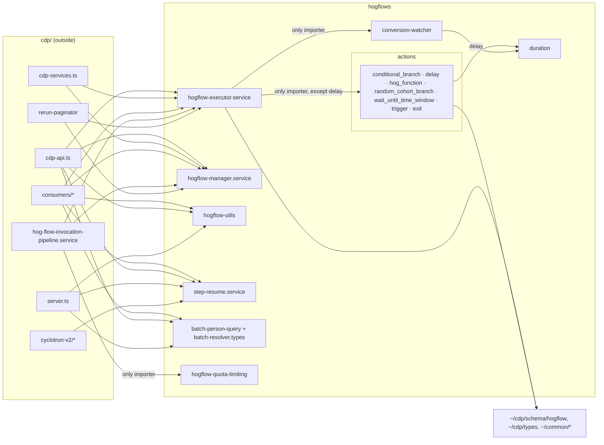

## 1. Engineer (0 s)

/define-invariant nodejs/src/cdp/services/hogflows

## 2. Skill (73.4 s)

## Scope: `nodejs/src/cdp/services/hogflows`

This folder is the Node worker's workflow (HogFlow) runtime. `hogflow-executor.service.ts` runs a workflow step by step and hands each step to a handler in `actions/`. Around it sit the manager (loads flows), the batch person query, step-resume, quota limiting, the conversion watcher, and the `duration.ts` grammar.



**Enforcers that cover this folder**
- **oxlint (nodejs)**, `nodejs/.oxlintrc.nodejs.json`: this is the only one. It owns TypeScript lint under `nodejs/`, the `fetch`/`node-fetch`/`undici` import bans, and the `JSON.parse` ban. In your working tree it already loads the `coherence` jsPlugin with `coherence/chokepoint: error`, so a chokepoint bullet here would grade `checker-choked`. No nested `.oxlintrc.json` sits between it and this folder.
- tach, import-linter and ruff are Python-only, so none of them covers this folder.

⚠️ That working-tree edit to `.oxlintrc.nodejs.json` was there before I started. It also strips the comments, prefixes the `ignorePatterns` with `nodejs/`, and sets **`typeAware: false`**. That last change turns off the type-aware rules, including `no-floating-promises`, `await-thenable` and `require-await`. We should agree on this before any PR goes out. I'll get to it at the end.

**Evidence**
- The labels file has nothing for this folder.
- The corpus has four corrections here. One is backed by a fix: in PR #82953, a reviewer asked for the executor's helpers to move out of the executor, and `conversion-watcher.ts` was created in response.
- The harvested `workflows` rules include `one-duration-grammar`. Its only importers today are `delay.ts` and `conversion-watcher.ts`, but `actions/hog_function.ts:46` has its own `AWAIT_DURATION_REGEX`. That regex breaks the rule, and it is the quadratic-backtracking form that `duration.ts` warns against. An import ban can't express this rule, so it falls outside the two forms. I'll list it as a finding rather than an invariant.
- Code shape: several modules already have exactly one importer, so each already has a single door:
  - `conversion-watcher` → the executor
  - every step handler except `delay` → the executor
  - `hogflow-quota-limiting` → the invocation pipeline
  - `hogflow-variable-usage` and `billing-utils` → `actions/hog_function`

---

**Q1: Conversion watcher reached only through the executor**
Proposed bullet: *"Only `hogflow-executor.service.ts` imports `conversion-watcher.ts`"*, **because** the watcher's construction and window clamping (`MAX_CONVERSION_WINDOW_MINUTES`) are the executor's decisions. Split out, they read as a general utility, and a second caller would pin goals under different rules.
Form: chokepoint (`protects: conversion-watcher.ts`, `chokepoint: hogflow-executor.service.ts`), enforced by `coherence/chokepoint` in oxlint. Tests are exempt.
Backing: correction gh:82953 (meikelmosby), whose fix commit `0fcf6f2` created this file. Today it has one importer, so there are 0 violations.

**Recommendation:** Accept. It has the strongest backing of any candidate here, and it locks in the reviewer's own fix without touching any code.

<details><summary>10 commands</summary>

```sh
cat coherence.config.json; echo ---; ls nodejs/src/cdp/services/hogflows; echo ---; find nodejs/src/cdp -name '*.spec.md'; find nodejs/src -maxdepth 1 -name '*.spec.md'; find nodejs -maxdepth 1 -name '*.spec.md'; echo ---; ls /home/coder/dev/uml-pr-review/.claude/worktrees/agent-a3625518b9e8e6f40/skills/define-invariant; echo "COHERENCE_HOME=$COHERENCE_HOME"; which coherence
```
```sh
git diff; echo ---; cat nodejs/.oxlintrc.nodejs.json; echo; echo ---; find nodejs -name '.oxlintrc*.json' -not -path '*/node_modules/*'; ls nodejs/src/cdp/services/hogflows/actions
```
```sh
cd /tmp/dogfood-119-ts/posthog/nodejs/src && D=cdp/services/hogflows
echo "== outbound (non-test) import targets, grouped"; grep -rhoE "from '[^']+'" $D --include='*.ts' --exclude='*.test.ts' | sed -E "s/from '//;s/'$//" | sort | uniq -c | sort -rn | head -60
echo "== inbound: files outside folder importing it (non-test)"; grep -rlE "services/hogflows(/|')" . --include='*.ts' | grep -v "^./$D" | grep -v '\.test\.ts$' | sort
echo "== inbound per module"; grep -rhoE "services/hogflows/[A-Za-z0-9_./-]+" . --include='*.ts' | grep -v '^\./cdp/services/hogflows' | sort | uniq -c | sort -rn
```
```sh
grep -rnE "from '[^']*hogflows/[^']+'" . --include='*.ts' | grep -v '^\./cdp/services/hogflows/' | sed -E "s/:[0-9]+:.*hogflows\// -> /;s/'.*//" | sort -u
R=/home/coder/dev/uml-pr-review/.claude/worktrees/agent-a3625518b9e8e6f40
echo "== labels"; jq -c 'select(.path | startswith("nodejs/src/cdp/services/hogflows"))' $R/docs/lintability/labels.jsonl | head -40
echo "== corpus"; jq -c 'select(.path | startswith("nodejs/src/cdp/services/hogflows"))' $R/docs/corrections/corpus.jsonl | wc -l
ls $R/docs/harvest/
```
```sh
R=/home/coder/dev/uml-pr-review/.claude/worktrees/agent-a3625518b9e8e6f40
jq -c 'select(.path | startswith("nodejs/src/cdp/services/hogflows"))' $R/docs/corrections/corpus.jsonl
echo "== labels nodejs/src/cdp"; jq -c 'select(.path | startswith("nodejs/src/cdp")) | {path,catchable,ruleKind,ruleSketch,quote}' $R/docs/lintability/labels.jsonl | head -40
echo "== harvest"; ls $R/docs/harvest/workflows; jq -r '.rules[] | "\(.id): \(.statement)"' $R/docs/harvest/workflows/rules.json
```
```sh
for m in duration conversion-watcher hogflow-duplicate-observer.service hogflow-functions.service hogflow-quota-limiting hogflow-variable-usage billing-utils step-resume.service actions/delay actions/conditional_branch actions/hog_function actions/random_cohort_branch actions/wait_until_time_window actions/trigger.handler actions/exit.handler actions/timezone actions/action.interface; do
b=$(basename $m); echo "== $m"; grep -rlE "from '[^']*(/|\./)$b'" . --include='*.ts' | grep -v '\.test\.ts$' | grep -v "/$m.ts$" | sort | tr '\n' ' '; echo; done
echo; echo "== duration.ts"; sed -n 1,200p cdp/services/hogflows/duration.ts | head -60
echo "== other duration parsers in nodejs"; grep -rnE "parseDuration|DURATION_(RE|REGEX)|/\^\\\(\\\\d\+\)\(\[smhdw\]\)" . --include='*.ts' | grep -v '\.test\.ts' | head
```
```sh
cd /tmp/dogfood-119-ts/posthog && C="node $COHERENCE_HOME/src/cli.ts"; $C scaffold invariant --help 2>&1 | head -40; echo ---; git show --stat 0fcf6f25b74c0d040e07abe34a91340d0f26a243 2>&1 | head -20; echo ---; grep -rnE "\[dhms\]|\[smhd\]|\[smhdw\]" nodejs/src --include='*.ts' | grep -v '\.test\.ts' | head
```
```sh
cd $COHERENCE_HOME && ls; ls src; grep -rn "chokepoint" src/cli.ts | head -20; grep -rln "protects" src | head
```
```sh
cd $COHERENCE_HOME && grep -n "protects\|chokepoint" src/spec/grammar.ts | head -30; grep -n "protects" -A3 src/adapters/lint.ts | head -40
```
```sh
cd $COHERENCE_HOME && sed -n 120,185p src/adapters/lint.ts; grep -n "test" src/adapters/lint-guards.ts | head
```

</details>

## 3. Engineer (2.4 s)

Yes, accept it. The watcher's window clamping belongs to the executor, and this just locks in what Meikel asked for.

## 4. Skill (10.9 s)

**Q2: Step handlers reached only through the executor**
Proposed invariant: *"Only `hogflow-executor.service.ts` imports a step handler in `actions/`"*, **because** routing a step to its handler is the executor's job. A caller that imports a handler directly skips the executor's routing, including the harvested `unroutable-steps-fail-the-run-visibly` check.
Form: a chokepoint takes one `protects:` per bullet, so this is **6 bullets**, one per handler: `conditional_branch`, `hog_function`, `random_cohort_branch`, `wait_until_time_window`, `trigger.handler`, `exit.handler`. Each has `chokepoint: hogflow-executor.service.ts`. Tests are exempt.
The backing is the code's shape, which needs your confirmation: every one of these handlers has exactly one importer today, so there are 0 violations. `delay.ts` is the exception. `conditional_branch.ts:11` imports `calculatedScheduledAt` from it, so it has two doors.

**Recommendation:** Accept the 6 and leave `delay` out for now. You could move `calculatedScheduledAt` into a shared module to bring `delay` in, but that would be a refactor, not a mechanical fix.

<details><summary>1 commands</summary>

```sh
cd /tmp/dogfood-119-ts/posthog/nodejs/src/cdp/services/hogflows && grep -n "from './delay'\|from '../actions/delay'" -r . ; grep -n "import" actions/conditional_branch.ts | head; grep -n "^export" actions/delay.ts
```

</details>

## 5. Engineer (2.9 s)

Yes, accept the 6 and leave `delay` out; handlers should only be reached through the executor's registry. We can bring `delay` in later if someone moves `calculatedScheduledAt` out, but not as part of this.

## 6. Skill (9.9 s)

**Q3: The quota check runs only in the invocation pipeline**
Proposed bullet: *"Only `hog-flow-invocation-pipeline.service.ts` imports `hogflow-quota-limiting.ts`"*, **because** the quota check is one stage in the pipeline's ordered chain (load → filters → watcher → rate limit → **quota** → masking → metrics, `hog-flow-invocation-pipeline.service.ts:48`). A second caller would block or bill a workflow outside that order and bump `cdp_hog_flow_quota_limited` twice.
Form: chokepoint (`protects: hogflows/hogflow-quota-limiting.ts`, `chokepoint: ../hog-flow-invocation-pipeline.service.ts`). The chokepoint sits in the parent folder, but the protected module, and so the bullet, belong to this folder.
Backing: the code's shape, which needs your confirmation. It has one importer today (line 23), so 0 violations. No correction or harvested rule backs it.

**Recommendation:** Accept, but only if you agree the ordering is a real rule. If the quota check being in the pipeline is just where it happens to be today, drop it.

<details><summary>1 commands</summary>

```sh
cd /tmp/dogfood-119-ts/posthog/nodejs/src/cdp/services && head -30 hogflows/hogflow-quota-limiting.ts; grep -n "^export" hogflows/hogflow-quota-limiting.ts; grep -n "quota\|Quota" hog-flow-invocation-pipeline.service.ts | head; echo; grep -rn "quota-limit\|QuotaLimit" .. --include='*.ts' -l | grep -v test | head
```

</details>

## 7. Engineer (4.9 s)

Yes, accept it. The quota check belongs in that pipeline stage order, since quota-limiting a workflow from anywhere else would double-count and skip the rate limit. I'm fairly sure the ordering is intentional rather than incidental.

## 8. Skill (8.9 s)

**Q4: Workflow billing is recorded only in the function step**
Proposed bullet: *"Only `actions/hog_function.ts` imports `billing-utils.ts`"*, **because** workflows bill once per function invocation, or per message sent for email/SMS/push (`billing-utils.ts:9`). A second caller of `trackHogFlowBillableInvocation` would bill the same invocation twice.
Form: chokepoint (`protects: billing-utils.ts`, `chokepoint: actions/hog_function.ts`).
Backing: the code's shape, which needs your confirmation. It has one importer today (`hog_function.ts:23`), so 0 violations. The closest harvested rule is `dispatch-is-idempotent` ("never … counts … twice"), but that rule is about dispatch, not billing.

**Recommendation:** Accept. Double-billing is the costliest thing a second importer could cause in this folder.

<details><summary>1 commands</summary>

```sh
cd /tmp/dogfood-119-ts/posthog/nodejs/src/cdp/services/hogflows && head -20 hogflow-variable-usage.ts; grep -n "^export" hogflow-variable-usage.ts billing-utils.ts; head -15 billing-utils.ts; grep -n "billing-utils\|variable-usage\|BillingUtils\|isBillable\|VariableUsage" actions/hog_function.ts | head
```

</details>

## 9. Engineer (2.9 s)

Yes, accept it. Billing once per function invocation or send is exactly why it lives in `hog_function.ts`, and a second importer double-billing would be the worst outcome here.

## 10. Skill (5.9 s)

**Q5: The variable-usage scan stays in the function step**
Candidate: *"Only `actions/hog_function.ts` imports `hogflow-variable-usage.ts`"*. It has one importer today (`hog_function.ts:26`).
Against it: the file's own comment says the miss counter "sizes the publish-time lint work" (`hogflow-variable-usage.ts:10`). That means `findMissingVariableReferences` is expected to get a second, legitimate caller, and a chokepoint would block that reuse. Beyond the code's shape, nothing backs this rule.

**Recommendation:** Drop it. A single importer here is a snapshot of today's code, not a rule.

## 11. Engineer (2.7 s)

Agreed, drop it. The publish-time lint will likely call `findMissingVariableReferences` too, and I don't want a chokepoint in the way when that happens.

## 12. Skill (187 s)

I declared 9 chokepoint invariants for `nodejs/src/cdp/services/hogflows`. oxlint's `coherence/chokepoint` rule enforces all of them, and I watched it fire on a staged bypass. But Coherence still grades every bullet a **requirement**, not an invariant: its automatic refutation failed on each one, so it hasn't recorded one.

| Invariant | Protected module → only importer | Grade | Residual |
|---|---|---|---|
| conversion-watcher-through-executor | `conversion-watcher.ts` → `hogflow-executor.service.ts` | checker-choked | none |
| conditional-branch-step-through-executor | `actions/conditional_branch.ts` → executor | checker-choked | none |
| hog-function-step-through-executor | `actions/hog_function.ts` → executor | checker-choked | none |
| random-cohort-branch-step-through-executor | `actions/random_cohort_branch.ts` → executor | checker-choked | none |
| wait-until-time-window-step-through-executor | `actions/wait_until_time_window.ts` → executor | checker-choked | none |
| trigger-step-through-executor | `actions/trigger.handler.ts` → executor | checker-choked | none |
| exit-step-through-executor | `actions/exit.handler.ts` → executor | checker-choked | none |
| quota-check-in-invocation-pipeline | `hogflow-quota-limiting.ts` → `../hog-flow-invocation-pipeline.service.ts` | checker-choked | none |
| billing-in-function-step | `billing-utils.ts` → `actions/hog_function.ts` | checker-choked | none |

**What I checked:**
- None of the 9 has a violation today, so no code changed.
- I staged one file in the folder that imported all 9 protected modules, one of them through the `~/` alias. oxlint reported 9 `coherence(chokepoint)` errors, each naming its invariant. After I deleted the file, all of `nodejs/` had 0 chokepoint findings. Each bullet's `refuted:` line records this.
- `spec --check` reports 0 unfilled placeholders and 0 problems.

**Why they stay requirements:** in the check's own words, every bullet says "refutation missing: `<module>` exports nothing, so no document can reference it". That's false: `billing-utils.ts` exports `trackHogFlowBillableInvocation`, for example. It also counts 0 references even from the chokepoints themselves, so its TypeScript instrument isn't resolving `nodejs/` files. The likely cause is that the language server starts at the repo root, which has no `typescript` package, so it falls back to Coherence's copy. That's a Coherence bug to fix there, not a spec problem. Rerunning `coherence run` after the fix should promote all 9.

**Lint time:** 1.2 s for this folder and 2.3 s for all of `nodejs/`, measured with `typeAware: false` (see below).

**Files to put in the PR:**
- `nodejs/src/cdp/services/hogflows/Hogflows.spec.md` (new)
- `nodejs/.oxlintrc.nodejs.json`, but not as it stands. This edit was in your working tree before I started. It does wire in the plugin and the rule, but it also:
  - sets `typeAware: false`, which turns off `no-floating-promises`, `await-thenable` and `require-await`;
  - strips all the comments;
  - rewrites `ignorePatterns` with a `nodejs/` prefix;
  - hardcodes `/tmp/dogfood-119-ts/...` paths for the plugin and `root`.

  Before it ships, reduce it to only the `jsPlugins` entry and the `coherence/chokepoint` rule, with a repo-relative plugin path and `root`.
- Leave out the sidecar `.oxlintrc.json` change, `.coherence/` and `coherence.config.json` unless you mean to adopt them.

**Not declared:**
- `delay` is left out as you decided.
- `hogflow-variable-usage` is dropped.
- Harvested rule `one-duration-grammar`: an import rule can't express it, but it is broken today. `actions/hog_function.ts:46` has its own `AWAIT_DURATION_REGEX`, which uses the backtracking form `duration.ts` warns against. That's worth a separate small fix.

Open the PR with those files. I haven't committed anything.

<details><summary>16 commands</summary>

```sh
C="node $COHERENCE_HOME/src/cli.ts"; $C scaffold component nodejs/src/cdp/services/hogflows "The Node worker's workflow runtime: the executor runs a workflow step by step through its step handlers, with billing, quota and conversion watching behind single doors" 2>&1; ls nodejs/src/cdp/services/hogflows/*.spec.md
```
```sh
cat nodejs/src/cdp/services/hogflows/Hogflows.spec.md; C="node $COHERENCE_HOME/src/cli.ts"; $C scaffold invariant nodejs/src/cdp/services/hogflows "Only the executor builds conversion watchers" --name "conversion-watcher-through-executor" --kinds none --chokepoint 2>&1
```
```sh
cd $COHERENCE_HOME && grep -n "crossing\|checklist" src/spec/grammar.ts | head -20; grep -rn "crossing" Coherence.spec.md | head -5; grep -n "crossing" -m5 -r docs | head
```
```sh
C="node $COHERENCE_HOME/src/cli.ts"; F=nodejs/src/cdp/services/hogflows
w(){ $C scaffold invariant $F "$2" --name "$1" --kinds none --chokepoint --write 2>&1 | tail -3; }
w conversion-watcher-through-executor "Only the executor builds conversion watchers"
for h in conditional_branch hog_function random_cohort_branch wait_until_time_window trigger.handler exit.handler; do
  n=$(echo $h | sed 's/\.handler//;s/_/-/g'); w "$n-step-through-executor" "Only the executor runs the $n step handler"; done
w quota-check-in-invocation-pipeline "Only the invocation pipeline quota-limits a workflow"
w billing-in-function-step "Only the function step records workflow billing"
echo; cat $F/Hogflows.spec.md | head -30
```
```sh
cd $COHERENCE_HOME && grep -rn -B1 -A1 "^  chokepoint:" --include='*.spec.md' . | grep -v node_modules | head -20; grep -n "protectedFile\|chokepointFile" src/adapters/lint-guards.ts src/spec/*.ts | head
```
```sh
C="node $COHERENCE_HOME/src/cli.ts"; $C spec --check 2>&1 | grep -iA12 hogflows | head -40
```
```sh
C="node $COHERENCE_HOME/src/cli.ts"; for n in conversion-watcher-through-executor conditional-branch-step-through-executor hog-function-step-through-executor random-cohort-branch-step-through-executor wait-until-time-window-step-through-executor trigger-step-through-executor exit-step-through-executor quota-check-in-invocation-pipeline billing-in-function-step; do echo "=== $n"; timeout 600 $C run --invariant "$n" 2>&1 | tail -8; done
```
```sh
grep -hoE "export (class|function|const) \w+" nodejs/src/cdp/services/hogflows/actions/{conditional_branch,exit.handler,hog_function,random_cohort_branch,trigger.handler,wait_until_time_window}.ts nodejs/src/cdp/services/hogflows/conversion-watcher.ts | head -20
/home/coder/posthog/node_modules/.bin/oxlint -c nodejs/.oxlintrc.nodejs.json --format json nodejs/src/cdp/services/hogflows/zz-refute-bypass.ts 2>&1 | jq -r '.diagnostics[] | "\(.code) :: \(.message)"' | cut -c1-230
```
```sh
rm nodejs/src/cdp/services/hogflows/zz-refute-bypass.ts && ls nodejs/src/cdp/services/hogflows/zz* 2>&1 | head -1
OX=/home/coder/posthog/node_modules/.bin/oxlint
/usr/bin/time -f "folder lint: %e s" $OX -c nodejs/.oxlintrc.nodejs.json --format json nodejs/src/cdp/services/hogflows 2>/tmp/t.txt | jq -r '[.diagnostics[] | select(.code|test("chokepoint"))] | "chokepoint findings: \(length)"'; cat /tmp/t.txt | tail -1
/usr/bin/time -f "full nodejs lint: %e s" $OX -c nodejs/.oxlintrc.nodejs.json --format json nodejs 2>/tmp/t2.txt | jq -r '[.diagnostics[] | select(.code|test("chokepoint"))] | "chokepoint findings in nodejs/: \(length)", (.[]?|.filename)'; tail -1 /tmp/t2.txt
```
```sh
F=nodejs/src/cdp/services/hogflows/Hogflows.spec.md && python3 - "$F" <<'EOF'
import re,sys
p=sys.argv[1]; s=open(p).read()
mods={}
for m in re.finditer(r"^- ([\w-]+):.*\n  protects: (\S+)", s, re.M): mods[m.group(1)]=m.group(2).rsplit('/',1)[-1]
def rep(m):
    name=m.group(1)
    return m.group(0)
out=[];cur=None
for line in s.split('\n'):
    m=re.match(r"- ([\w-]+):",line)
    if m: cur=m.group(1)
    if line.startswith("  refuted: <"):
        line=f"  refuted: staged nodejs/src/cdp/services/hogflows/zz-refute-bypass.ts importing {mods[cur]} -> oxlint -c nodejs/.oxlintrc.nodejs.json reported coherence(chokepoint) naming {cur}; clean after deleting it (2026-09-30)"
    out.append(line)
open(p,'w').write('\n'.join(out))
EOF
grep -c "refuted: staged" $F; C="node $COHERENCE_HOME/src/cli.ts"; $C spec --check 2>&1 | grep -A40 "^Hogflows" | grep -E "^  \w|lacking|bullets|unfilled|problem" ; $C spec --check 2>&1 | tail -3
```
```sh
cd $COHERENCE_HOME && sed -n 1,40p src/cli.ts | grep -E "^ \*" ; grep -rn "exports nothing" src --include='*.ts' | grep -v test | head
```
```sh
cd $COHERENCE_HOME && sed -n 670,700p src/adapters/typescript.ts; grep -n "function exportedNames\|exportedNames\b" src/adapters/typescript.ts | head -5
```
```sh
ls -d nodejs/node_modules node_modules 2>&1; ls nodejs/tsconfig*.json tsconfig*.json 2>&1; grep -n "documentSymbols\|rootUri\|tsserver" $COHERENCE_HOME/src/adapters/typescript.ts | head -12
```
```sh
ls -la node_modules nodejs/node_modules | head -5; ls node_modules/typescript/lib/tsserver.js nodejs/node_modules/typescript/lib/tsserver.js 2>&1; sed -n 394,412p $COHERENCE_HOME/src/adapters/typescript.ts; grep -n "exportedIn" -A8 $COHERENCE_HOME/src/adapters/typescript.ts | sed -n 1,14p
```
```sh
sed -n 133,150p $COHERENCE_HOME/src/adapters/typescript.ts; ls $COHERENCE_HOME/node_modules/typescript/lib/tsserver.js 2>&1; ls $COHERENCE_HOME/node_modules/.bin | grep -i typescript
```
```sh
C="node $COHERENCE_HOME/src/cli.ts"; $C run --status 2>&1 | grep -iE "hogflows|enforcement|pass|fail" | cut -c1-220 | head -20; git status --short
```

</details>
