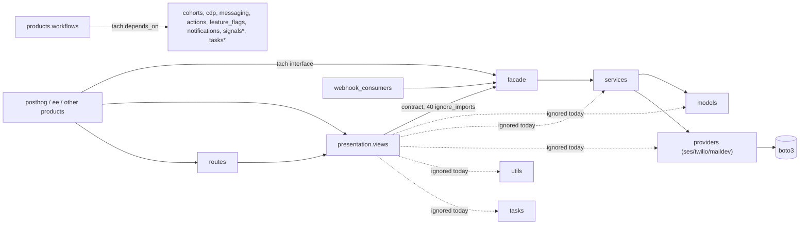

Skill: `skills/define-invariant` (SKILL.md + enforcers.md), sha256 494ff331ed4f. Model: claude-opus-5-5.

## 1. Engineer (0 s)

/define-invariant products/workflows/backend

## 2. Skill (46.8 s)

I've mapped the folder, the enforcers that cover it, and the evidence. First question at the end.

## Scope: `products/workflows/backend`

No `*.spec.md` exists in the folder or above it. `coherence.config.json` sets the language to Python and has one lint tool, `ruff`.



**Enforcers that cover the folder:**

| Enforcer | What it covers here |
|---|---|
| tach (`tach.toml:1096`, interfaces at `:1120`) | Which products `products.workflows` may depend on. From outside, only `backend.facade.*`, `presentation.views.*` and `routes.*` can be imported. Right now nothing outside the product imports its internals. |
| import-linter (`pyproject.toml` `products.*.backend` contracts) | `presentation` may reach only `facade` (with a 40-line `ignore_imports` wave for `views.hog_flow` and others). `routes` may reach only `presentation`, and `webhook_consumers` only `facade`. `facade` must not import `presentation` or DRF (one ignore for `facade.api → views.hog_flow`). |
| ruff (`products/ruff.toml` → `pyproject.toml`) | General lint plus ANN rules (the folder is exempt from ANN) and PLC0415. `TID251` is not selected, and the folder has no `ruff.toml` of its own. |
| oxlint | Does not apply, because there is no TypeScript under `backend/`. |

**Evidence:**
- **Corrections:** 13 for the product. Only two are in this folder and could back a rule: `providers/ses.py` "we should have the boto3 type somewhere to import", and the `_strip_secret_inputs` duplication. The rest cover the frontend or MCP, or are design questions.
- **Harvested rules:** 30 in `docs/harvest/workflows/rules.json`.
  - `facade-is-the-only-way-in` is already enforced by tach and import-linter, so it's out.
  - Most of the others are behavioural (the serializer validates, stamps fence stale writes, dispatch is idempotent), and no import rule or ban can enforce them.
  - Two have a shape that fits:
    - `one-duration-grammar`: `utils/durations.py`
    - `server-compiles-all-bytecode`: only `presentation/views/hog_flow.py` compiles bytecode today.

**Lead from the code's shape (not backing yet):** `boto3` is imported only by `providers/ses.py`.

**Q1: Should boto3/SES be reachable only through `providers/ses.py`?**
Inside `products/workflows/backend`, only `providers/ses.py` imports `boto3`. If that's a rule, it becomes a ruff `TID251` totality oracle: a `backend/ruff.toml` bans `boto3`, and `providers/ses.py` is excluded as the paved path. There are 0 violations today. The only correction on that file asks for imported boto3 types rather than hand-built ones, so it doesn't back this rule by itself. I need you to state the rule and its reason.

**Recommendation:** Accept it, with this reason: "SES tenant/identity handling, retries and region config live in one provider, so services never talk to AWS directly." Drop it if that isn't the real reason.

<details><summary>6 tool calls</summary>

```
Bash: cd /tmp/dogfood-119-py/posthog; cat coherence.config.json; echo ---; find products/workflows -name '*.spec.md' -not -path '*/node_modules/*'; find products -maxdepth 1 -name '*.spec.md'; ls *.spec.md 2>/dev/null; echo ---; ls products/workflows/backend; echo ---; cat /home/coder/dev/uml-pr-review/.claude/worktrees/agent-a3625518b9e8e6f40/skills/define-invariant/enforcers.md; echo; echo COH=$COHERENCE_HOME; which coherence
```
```
Bash: cd /tmp/dogfood-119-py/posthog; find products/workflows products -maxdepth 3 -name '*.spec.md' | head; grep -n -B2 -A25 'workflows' tach.toml | head -80; echo ---IL; grep -n 'importlinter' pyproject.toml | head; ls products/workflows/backend/{facade,presentation,services,providers,models,utils,tasks,webhook_consumers.py} 2>&1 | head -80; cat products/ruff.toml; ls products/workflows/backend/ruff.toml 2>&1
```
```
Bash: cd /tmp/dogfood-119-py/posthog; grep -n -A12 'path = "products.workflows"' tach.toml; grep -n -B3 -A10 'products.workflows' tach.toml | grep -n -A10 interfaces | head -30; echo ---IL; sed -n 556,900p pyproject.toml | grep -n -i -E 'name|workflows|products\.\*|source|forbidden|layers|type|ignore' | head -80
```
```
Bash: cd /tmp/dogfood-119-py/posthog; sed -n 1108,1125p tach.toml; grep -n -B2 -A6 'from_modules.*workflows\|"products.workflows"\]' tach.toml | head -30; sed -n 880,960p pyproject.toml | grep -n -E 'name|type|source|forbidden|workflows' ; R=/home/coder/dev/uml-pr-review/.claude/worktrees/agent-a3625518b9e8e6f40; ls $R/docs/harvest/ ; for f in labels; do jq -c 'select(.path | startswith("products/workflows"))' $R/docs/lintability/labels.jsonl | wc -l; done; jq -c 'select(.path | startswith("products/workflows"))' $R/docs/corrections/corpus.jsonl | wc -l
```
```
Bash: cd /tmp/dogfood-119-py/posthog; sed -n 1118,1140p tach.toml; grep -n 'workflows' tach.toml | sed -n 1,40p | grep -v depends; R=/home/coder/dev/uml-pr-review/.claude/worktrees/agent-a3625518b9e8e6f40; echo ---L; jq -c 'select(.path | startswith("products/workflows"))|{path,catchable,ruleKind,ruleSketch,quote}' $R/docs/lintability/labels.jsonl; echo ---C; jq -c 'select(.path | startswith("products/workflows"))' $R/docs/corrections/corpus.jsonl | cut -c1-600; echo ---H; jq -r '.rules[] | "\(.id): \(.statement)"' $R/docs/harvest/workflows/rules.json
```
```
Bash: cd /tmp/dogfood-119-py/posthog/products/workflows/backend; echo BOTO; grep -rln 'import boto3\|from boto3\|botocore' --include=*.py . | grep -v /test; echo DUR; grep -rn 'def ' utils/durations.py | head; grep -rln 'durations import\|parse_duration\|timedelta(' --include=*.py . | grep -v test | head -20; echo BYTE; grep -rln 'compile_hog\|create_bytecode\|compile_filters_bytecode' --include=*.py . | grep -v test; echo FACADE-IMPORTERS; grep -rln 'products.workflows.backend\.\(services\|models\|providers\|utils\|tasks\)' /tmp/dogfood-119-py/posthog/{posthog,ee,products} --include=*.py 2>/dev/null | grep -v '^/tmp/dogfood-119-py/posthog/products/workflows' | wc -l
```

</details>

## 3. Engineer (5.5 s)

Yes, go ahead. The reason is right: AWS/SES specifics (identity, region, retries) stay in the provider so services only use the provider interface. Keep the ban scoped to `backend/` only.

## 4. Skill (25.7 s)

**Q2: Should bytecode be compiled only in the HogFlow serializer?**
The harvested rule `server-compiles-all-bytecode` says "only the server compiles bytecode; client bytecode is discarded on every write path". An import ban can't check the discarding part. What it can check is related but different: within `backend/`, `create_bytecode`, `compile_filters_expr`, `compile_filters_bytecode` and `generate_template_bytecode` are called only from `presentation/views/hog_flow.py`. That would be a ruff `TID251` totality oracle in the same `backend/ruff.toml`, with `hog_flow.py` as the paved path. Today the only other callers are two tests (`test/test_github_trigger_filters.py`, `test/test_slack_trigger_filters.py`), which would become a listed residual.

I'm not proposing `one-duration-grammar`: it's about matching the Node worker, and no import rule can express that.

**Recommendation:** Drop it. The harvested rule doesn't ask for a single compile site, and a ban would block legitimate compiling later, such as a facade or a management backfill, without protecting the discard behaviour that actually matters. Accept only if you want compiling tied to the serializer, and tell me why.

<details><summary>2 tool calls</summary>

```
Bash: cd /tmp/dogfood-119-py/posthog/products/workflows/backend; sed -n 1,45p utils/durations.py; echo ---; grep -rn 'durations import\|isodate\|pytimeparse\|dateutil.relativedelta\|re.compile(.*[smhdw]' --include=*.py . | grep -v '/test' ; echo ---BYTE; grep -rn 'compile_hog\|create_bytecode\|compile_filters_bytecode\|bytecode' presentation/views/hog_flow.py | head -15; grep -rn '^from\|^import' presentation/views/hog_flow.py | grep -i 'bytecode\|compil'
```
```
Bash: cd /tmp/dogfood-119-py/posthog/products/workflows/backend; grep -rln 'create_bytecode\|compile_filters_expr\|compile_filters_bytecode\|generate_template_bytecode\|compile_hog' --include=*.py . 
```

</details>

## 5. Engineer (3.8 s)

Drop it; I agree a single compile site isn't the invariant, and the discard behaviour is what matters, which a ban can't check.

## 6. Skill (22.9 s)

**Q3: The two tests that import botocore/boto3: listed residual or fix?**
With the draft ban in place, ruff's only new findings are `TID251`, and apart from the paved path `providers/ses.py` just two files trip it:
- `test/test_ses_provider.py`: raises `botocore.exceptions.ClientError`, and at line 414 reads the real `boto3.client("sesv2").meta.service_model` to check call shapes against it.
- `test/test_ses_account_reputation_task.py`: uses `ClientError` as a mock's `side_effect`.

Both test the provider's own boundary with AWS, so they need the real AWS types. The mechanical fix would have `providers/ses.py` re-export `ClientError`, which only moves the leak, and the service-model check can't be fixed that way at all.

**Recommendation:** List these two files by name as a residual, in `[lint.extend-per-file-ignores]` and in `over:`, rather than as a `test/**` glob. That way a new test that reaches for boto3 still gets flagged.

<details><summary>3 tool calls</summary>

```
Bash: cd /tmp/dogfood-119-py/posthog; grep -rn 'boto3\|botocore' --include=*.py products/workflows/backend | grep -v 'providers/ses.py' | head; C="node $COHERENCE_HOME/src/cli.ts"; $C --help 2>&1 | head -40
```
```
Bash: cd /tmp/dogfood-119-py/posthog; R="/home/coder/.local/bin/uvx ruff@0.15.20 check --force-exclude --output-format concise"; $R products/workflows/backend 2>&1 | tail -3; cat > products/workflows/backend/ruff.toml <<'EOF'
extend = "../../ruff.toml"

[lint]
extend-select = ["TID251"]

[lint.flake8-tidy-imports.banned-api]
"boto3".msg = "draft"
"botocore".msg = "draft"
EOF
$R products/workflows/backend 2>&1 | tail -15
```
```
Bash: cd /tmp/dogfood-119-py/posthog/products/workflows/backend; grep -n 'boto3\.\|ClientError\|botocore' test/test_ses_provider.py | grep -v 'mock_boto3\|boto3_client_patcher\|providers.ses.boto3' | head; echo ---; grep -n 'ClientError\|botocore' test/test_ses_account_reputation_task.py | head; echo ---; sed -n 10,20p providers/ses.py
```

</details>

## 7. Engineer (3.4 s)

Yes, list those two files by name as the residual. They test the provider's own AWS boundary, so re-exporting `ClientError` would just move the leak.

## 8. Skill (52.7 s)

`products/workflows/backend` now has one declared invariant. It is enforced by ruff and was proven by a staged break, and nothing is committed.

| Invariant | Form | Grade | Enforcer | Listed residual |
|---|---|---|---|---|
| `ses-only-through-provider`: only `providers/ses.py` imports `boto3` or `botocore` | lint totality oracle (paved path `providers/ses.py`) | **invariant**, verified 2026-09-30 | ruff `TID251` in a new `backend/ruff.toml` | `test/test_ses_provider.py`, `test/test_ses_account_reputation_task.py` |

**How I proved it:** I added a file `services/_refute_ses_bypass.py` that imports `boto3`. `TID251` went red on it at line 1 with the invariant's name in the message, and `coherence refute` recorded that. I then deleted the file, `coherence run` passed, and the bullet's `refuted:` line records all of this. `coherence spec --check` reports 1 invariant, 0 placeholders and 0 problems, and `coherence run --status` shows it verified.

Besides this one, the invariant is the only rule declared:
- **Dropped:** single bytecode compile site (Q2), and `one-duration-grammar`, which is about matching the Node worker and no import rule can express.
- **Out:** `facade-is-the-only-way-in`, because tach and import-linter already enforce it.
- There are no requirements left open.

**Files changed:**
- `products/workflows/backend/Backend.spec.md` (new): the component spec with the bullet. I left out the `crossing:` line because no trust boundary is involved.
- `products/workflows/backend/ruff.toml` (new): extends `products/ruff.toml`. It turns on `TID251` and bans `boto3` and `botocore` with a message that names the invariant and its spec. It excludes the paved path and the two residual files by name under `[lint.extend-per-file-ignores]`. Before and after the change, ruff over the folder reports no other findings.
- `.coherence/` holds the run records; it's untracked, and whether to commit it is your call.
- `coherence.config.json` was already untracked before this session.

**Lint time:** 149 ms per run over the folder with the command from `coherence.config.json`:
```
/home/coder/.local/bin/uvx ruff@0.15.20 check --force-exclude --output-format json products/workflows/backend
```

Please open a PR with `Backend.spec.md` and `ruff.toml`. From now on, changes to this rule go through PR review.

<details><summary>11 tool calls</summary>

```
Bash: cd /tmp/dogfood-119-py/posthog; C="node $COHERENCE_HOME/src/cli.ts"; $C scaffold component products/workflows/backend "Workflows backend: HogFlow models, services, providers and the facade other products reach it through" 2>&1 | tail -20; echo ======; $C scaffold invariant products/workflows/backend "Only providers/ses.py imports boto3 or botocore; services reach AWS SES through the provider" --name "ses-only-through-provider" --kinds none --totality-oracle --write 2>&1 | tail -40
```
```
Read: /tmp/dogfood-119-py/posthog/products/workflows/backend/Backend.spec.md
```
```
Bash: cd /tmp/dogfood-119-py; grep -rn -A7 'via: lint' --include=*.spec.md . 2>/dev/null | grep -v node_modules | head -40; grep -rn 'crossing' coherence/docs coherence/README* 2>/dev/null | head -15
```
```
Bash: cd /tmp/dogfood-119-py/coherence; grep -rln 'crossing' src | head; grep -rn -i 'crossing.*optional\|no crossing\|crossing:.*none\|trust level' src/*.ts src/**/*.ts 2>/dev/null | head -15; grep -rn 'via: lint' -r docs test* src 2>/dev/null | head -8
```
```
Bash: cd /tmp/dogfood-119-py/coherence; sed -n 60,140p docs/spec.md; grep -n -i 'crossing' docs/spec.md | head
```
```
Edit: /tmp/dogfood-119-py/posthog/products/workflows/backend/Backend.spec.md
```
```
Write: /tmp/dogfood-119-py/posthog/products/workflows/backend/ruff.toml
```
```
Bash: cd /tmp/dogfood-119-py/posthog; /home/coder/.local/bin/uvx ruff@0.15.20 check --force-exclude --output-format concise products/workflows/backend; node $COHERENCE_HOME/src/cli.ts spec --check 2>&1 | grep -v '^$' | grep -i -B2 -A12 'workflows/backend\|ses-only\|problem' | head -40
```
```
Bash: cd /tmp/dogfood-119-py/posthog; C="node $COHERENCE_HOME/src/cli.ts"; F=products/workflows/backend/services/_refute_ses_bypass.py; printf 'import boto3\n\nclient = boto3.client("sesv2")\n' > $F; /home/coder/.local/bin/uvx ruff@0.15.20 check --force-exclude --output-format concise $F; $C refute "products/workflows/backend/ses-only-through-provider" --broke "staged services/_refute_ses_bypass.py importing boto3 and building an sesv2 client" 2>&1 | tail -15; rm $F; echo ===; $C run --invariant "ses-only-through-provider" 2>&1 | tail -15
```
```
Edit: /tmp/dogfood-119-py/posthog/products/workflows/backend/Backend.spec.md
```
```
Bash: cd /tmp/dogfood-119-py/posthog; C="node $COHERENCE_HOME/src/cli.ts"; $C spec --check 2>&1 | grep -A8 'workflows/backend'; $C spec --check >/dev/null 2>&1; echo exit=$?; $C run --status 2>&1 | grep -A3 ses-only; ls products/workflows/backend/services/_refute* 2>&1; git status --short; /usr/bin/time -f 'lint %es' /home/coder/.local/bin/uvx ruff@0.15.20 check --force-exclude --output-format json products/workflows/backend >/dev/null
```

</details>
