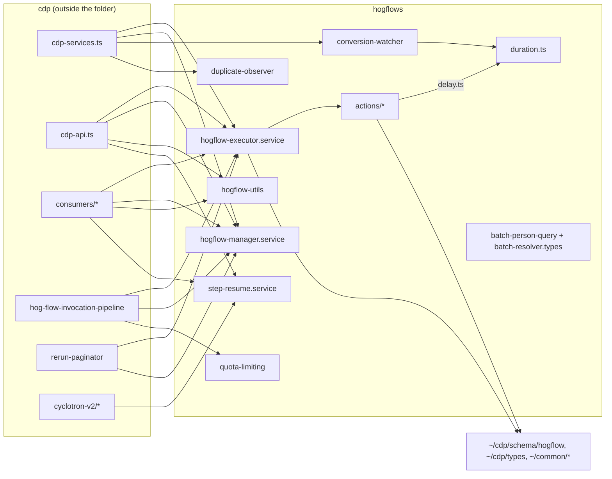

Skill: `skills/define-invariant` (SKILL.md + enforcers.md), sha256 494ff331ed4f. Model: claude-opus-5-5.

## 1. Engineer (0 s)

/define-invariant nodejs/src/cdp/services/hogflows

## 2. Skill (72.6 s)

`nodejs/src/cdp/services/hogflows` is the Node worker's workflow engine. `hogflow-executor.service.ts` routes each step through the handlers in `actions/`. Around it sit the manager (loads flows), the functions service, the batch person query, step resume, quota limiting, the conversion watcher, the duplicate observer, and the `duration.ts` grammar.



Only one enforcer covers this folder, and it's TypeScript only. tach, import-linter and ruff are all Python and don't reach it.

- **`nodejs/.oxlintrc.nodejs.json`** covers all of `nodejs/`. Here it owns:
  - bans on `fetch` / `node-fetch` / `undici` (`no-restricted-imports` / `no-restricted-globals`)
  - the `JSON.parse` ban (`eslint-js/no-restricted-syntax`)
  - the usual TS hygiene rules
  - `coherence/chokepoint`, already wired in as uncommitted setup. The one nested config, the sidecar's, has it too, so a TypeScript chokepoint would get `checker-choked` credit.
- None of its overrides reaches `src/cdp`.

Evidence: the four reviewer corrections on this folder ask about placement or reuse, not about a lintable rule. The harvested `workflows` rules give one strong lead. `one-duration-grammar` says: "Every workflow duration is parsed by one grammar." `actions/hog_function.ts:46` breaks it today. It has its own `AWAIT_DURATION_REGEX = /^(\d*\.?\d+)([dhms])$/`, which is the quadratic form that `duration.ts`'s header warns against, instead of calling `parseDuration`.

**Q1: One duration grammar in the Node worker**
Sentence: *"Every workflow duration under `nodejs/src/cdp` is parsed by `parseDuration`/`durationSeconds` in `hogflows/duration.ts`; no other module declares a `[dhms]` duration regex."*
Because: `duration.ts` is the Node half of the grammar Django enforces, and it's written to match linearly. A second regex can drift from the API and backtrack.
Form: **lint totality oracle**. An `eslint-js/no-restricted-syntax` entry bans regex literals containing `[dhms]` in `src/cdp/**`, excluding `duration.ts`. The bullet reads `via: lint oxlint:eslint-js/no-restricted-syntax matching "one-duration-grammar"`. This isn't an import ban, so `no-restricted-imports` can't express it. Coherence matches any oxlint rule id.
Backing: the harvested rule `one-duration-grammar` (pr#81114, `graph-schema.md`).
The one current violation is `hog_function.ts`. It can be fixed mechanically with `durationSeconds` plus the existing 24h ceiling.

**Recommendation:** Accept, and fix `hog_function.ts` now rather than listing it as a residual. It's one call site, and it's the exact drift the rule exists to stop.

<details><summary>13 tool calls</summary>

```
Bash: cat coherence.config.json; echo ---; echo "COHERENCE_HOME=$COHERENCE_HOME"; ls nodejs/src/cdp/services/hogflows; echo ---; find nodejs/src/cdp nodejs/src nodejs -maxdepth 1 -name '*.spec.md' 2>/dev/null; find nodejs/src/cdp/services/hogflows -name '*.spec.md'; echo ---; git diff --stat; ls nodejs/.oxlintrc* nodejs/src/cdp/.oxlintrc* 2>/dev/null; ls /home/coder/dev/uml-pr-review/.claude/worktrees/agent-a3625518b9e8e6f40/skills/define-invariant
```
```
Bash: cat /home/coder/dev/uml-pr-review/.claude/worktrees/agent-a3625518b9e8e6f40/skills/define-invariant/enforcers.md; echo ----; git diff nodejs/.oxlintrc.nodejs.json | head -150; echo; git diff nodejs/src/ingestion/pipelines/sessionreplay/ml-mirror-image-scrub-sidecar/.oxlintrc.json
```
```
Bash: find . -name '*.spec.md' -not -path '*/node_modules/*' 2>/dev/null | head; ls tach.toml .importlinter nodejs/tach.toml 2>/dev/null; grep -n "cdp" tach.toml 2>/dev/null | head; find nodejs -name '.oxlintrc*' -not -path '*/node_modules/*'; grep -n "hogflow\|cdp" nodejs/.oxlintrc.nodejs.json | head -40
```
```
Bash: python3 -c "
import json;c=json.load(open('nodejs/.oxlintrc.nodejs.json'))
print(json.dumps({k:v for k,v in c.items() if k!='rules'},indent=1)[:4000])
print('coherence rule:',c['rules'].get('coherence/chokepoint'))
print(json.dumps(c['rules'].get('eslint/no-restricted-imports'),indent=1))
"
```
```
Bash: cd /tmp/dogfood-119-ts/posthog/nodejs && ls src/cdp/services/hogflows/actions; echo "--- OUT (non-test) ---"; grep -rhoE "from '[^']+'" src/cdp/services/hogflows --include=*.ts | grep -v test | sort | uniq -c | sort -rn | head -60
```
```
Bash: echo "--- IN (who imports hogflows/*, outside folder) ---"; grep -rnE "services/hogflows/|from '\./hogflows/|from '\.\./hogflows/" src --include=*.ts | grep -v "^src/cdp/services/hogflows/" | grep -v "\.test\.ts" | sed -E "s#:[0-9]+:.*(hogflows/[^'\"]+).*#  ->  \1#" | sort | uniq | awk '{print $3" <- "$1}' | sort
```
```
Bash: R=/home/coder/dev/uml-pr-review/.claude/worktrees/agent-a3625518b9e8e6f40; cd /tmp/dogfood-119-ts/posthog/nodejs; for f in billing-utils conversion-watcher duration hogflow-variable-usage hogflow-duplicate-observer.service hogflow-quota-limiting actions/; do echo "== $f"; grep -rlE "hogflows/$f|['\"]\.{1,2}/.*$f" src --include=*.ts | grep -v test | grep -v "^src/cdp/services/hogflows/actions/" ; done 2>/dev/null; echo; ls $R/docs/lintability $R/docs/corrections $R/docs/harvest 2>&1; for p in nodejs/src/cdp/services/hogflows nodejs/src/cdp; do echo "== labels $p"; jq -c "select(.path | startswith(\"$p\"))" $R/docs/lintability/labels.jsonl | wc -l; echo "== corpus $p"; jq -c "select(.path | startswith(\"$p\"))" $R/docs/corrections/corpus.jsonl | wc -l; done
```
```
Bash: R=/home/coder/dev/uml-pr-review/.claude/worktrees/agent-a3625518b9e8e6f40; echo "== corpus hogflows"; jq -c 'select(.path | startswith("nodejs/src/cdp/services/hogflows"))' $R/docs/corrections/corpus.jsonl | cut -c1-900; echo "== labels cdp"; jq -c 'select(.path | startswith("nodejs/src/cdp")) | {path,catchable,ruleKind,ruleSketch,quote}' $R/docs/lintability/labels.jsonl | cut -c1-700; ls $R/docs/harvest/workflows; jq -r '.rules[] | "\(.id): \(.statement)"' $R/docs/harvest/workflows/rules.json 2>/dev/null | head -60
```
```
Bash: R=/home/coder/dev/uml-pr-review/.claude/worktrees/agent-a3625518b9e8e6f40; cd /tmp/dogfood-119-ts/posthog/nodejs; jq '.rules[] | select(.id=="one-duration-grammar" or .id=="test-runs-share-production-trigger-predicates" or .id=="closed-type-sets-have-one-home")' $R/docs/harvest/workflows/rules.json | head -80; echo ====; head -40 src/cdp/services/hogflows/duration.ts; grep -rn "duration'" src --include=*.ts | grep -v test
```
```
Bash: R=/home/coder/dev/uml-pr-review/.claude/worktrees/agent-a3625518b9e8e6f40; cd /tmp/dogfood-119-ts/posthog/nodejs; jq '.rules[] | select(.id=="one-duration-grammar") | {currentLevel,currentLevelBasis,proposedLevel,howToEnforce,evidence:[.evidence[]|{origin,quote}]}' $R/docs/harvest/workflows/rules.json; grep -rnE "\[dhms\]|Duration\.from|from 'ms'|parse-duration|dhms" src/cdp --include=*.ts | grep -v test | head -20
```
```
Bash: cd /tmp/dogfood-119-ts/posthog/nodejs; grep -rn "isOwnGithubEvent" src --include=*.ts | grep -v test; sed -n 40,75p src/cdp/services/hogflows/actions/hog_function.ts; git log --oneline -3 -- src/cdp/services/hogflows/actions/hog_function.ts src/cdp/services/hogflows/duration.ts
```
```
Bash: cd $COHERENCE_HOME && grep -rn "no-restricted" src --include=*.ts | grep -v test | head -15
```
```
Bash: cd $COHERENCE_HOME && sed -n 195,245p src/enforcement/lint.ts
```

</details>

## 3. Engineer (2.9 s)

Yes, go ahead with the lint rule, and fix `hog_function.ts` now with `durationSeconds` and the 24h ceiling. Keep the regex match narrow so it only catches duration-shaped literals and not every character class that happens to contain those letters.

## 4. Skill (155.6 s)

Q1 is done and it now reads as an **invariant**:

- **Fix:** `actions/hog_function.ts` now parses `max_wait` with `durationSeconds` and keeps the 24h ceiling. I dropped its local regex and unit table. Under flox Node, 18/18 await tests pass, including "clamps a wait past the ceiling" and the `'190min'` parse-failure log.
- **Lint entry:** a new `src/cdp/**/*.ts` override in `nodejs/.oxlintrc.nodejs.json`, with `duration.ts` in `excludeFiles` as the paved path. It repeats the global `JSON.parse` ban because the override replaces the rule's options.
- **Selector:** `Literal[regex.pattern=/\[[dhms]{4}\]\)?\$$/]` is narrow, as you asked. It only catches a regex literal ending in a four-letter d/h/m/s class followed by `$`. In the probe it fired on `([dhms])$` and `([smhd])$` and stayed quiet on `[a-z]+`, the unanchored `/[dhms]/g`, and `[dhmsz]`. The `because:` states the gap: `new RegExp(...)` and string splitting get past it.
- **Refutation witnessed:** I staged the old regex, oxlint went red at the staged file, and after I removed it, 0 findings across 1674 files. `spec --check` reports 0 placeholders and 0 problems.

**Q2: Only the executor imports the action handlers?**
Right now `hogflow-executor.service.ts` is the only importer of each handler: `conditional_branch`, `delay`, `exit.handler`, `hog_function`, `random_cohort_branch`, `trigger.handler`, `wait_until_time_window`. There's one exception: `conditional_branch.ts` imports `calculatedScheduledAt` from `delay.ts`. That's a code-shape lead, not backing. No correction or harvested rule asks for it. The executor's `actionHandlers: Record<HogFlowAction['type'], ActionHandler>` already makes it the one registry of step types. As chokepoints this would be roughly seven module-form bullets, one per handler file. `delay.ts` would first need `calculatedScheduledAt` moved out.
Is "only the executor reaches an action handler" a rule your team holds? If so, what's the reason (for example, `cdp-api` test runs must go through the same routing as production)?

**Recommendation:** Drop it, unless you can state that reason. Without one, seven bullets would lock in today's shape rather than protect a rule.

<details><summary>22 tool calls</summary>

```
Bash: cd /tmp/dogfood-119-ts/posthog/nodejs && sed -n 40,80p src/cdp/services/hogflows/duration.ts; grep -n "SECONDS_PER_UNIT\|AWAIT_DURATION_REGEX\|^import" src/cdp/services/hogflows/actions/hog_function.ts; grep -rnE "/[^/]*\[[a-z]*d[a-z]*h[a-z]*m[a-z]*s[a-z]*\][^/]*/" src --include=*.ts | grep -v node_modules | head
```
```
Read: /tmp/dogfood-119-ts/posthog/nodejs/src/cdp/services/hogflows/actions/hog_function.ts
```
```
mcp__coder__coder_workspace_edit_file: /tmp/dogfood-119-ts/posthog/nodejs/src/cdp/services/hogflows/actions/hog_function.ts
```
```
Edit: /tmp/dogfood-119-ts/posthog/nodejs/src/cdp/services/hogflows/actions/hog_function.ts
```
```
Edit: /tmp/dogfood-119-ts/posthog/nodejs/src/cdp/services/hogflows/actions/hog_function.ts
```
```
Edit: /tmp/dogfood-119-ts/posthog/nodejs/src/cdp/services/hogflows/actions/hog_function.ts
```
```
Bash: grep -n "max_wait" src/cdp/services/hogflows/actions/hog_function.test.ts | head; npx tsc --noEmit -p tsconfig.json 2>&1 | grep -E "hog_function|duration" | head; echo tsc-done
```
```
Bash: timeout 500 npx jest src/cdp/services/hogflows/actions/hog_function.test.ts src/cdp/services/hogflows/duration.test.ts 2>&1 | tail -25
```
```
Bash: cd /home/coder/posthog && flox activate -- bash -c 'cd /tmp/dogfood-119-ts/posthog/nodejs && node --version && timeout 500 npx jest src/cdp/services/hogflows/actions/hog_function.test.ts -t "wait|await" 2>&1 | tail -30'
```
```
Bash: S=/home/coder/posthog/node_modules/oxlint/configuration_schema.json; ls -la /home/coder/posthog/node_modules/.bin/oxlint; /home/coder/posthog/node_modules/.bin/oxlint --version; jq '.definitions.OxlintOverride.properties | keys' $S 2>/dev/null || grep -o '"excludeFiles"' $S | head -2
```
```
Bash: grep -n "" nodejs/.oxlintrc.nodejs.json | sed -n '/"overrides"/,$p' | tail -25
```
```
Bash: node $COHERENCE_HOME/src/cli.ts scaffold --help 2>&1 | head -40
```
```
Bash: node $COHERENCE_HOME/src/cli.ts scaffold component nodejs/src/cdp/services/hogflows "The Node worker's workflow engine: the executor routes each step of a HogFlow through its action handler, and the modules around it load flows, resume parked steps, limit quota and parse workflow durations." 2>&1 | tail -30; git status --short
```
```
Edit: /tmp/dogfood-119-ts/posthog/nodejs/.oxlintrc.nodejs.json
```
```
Bash: F=nodejs/src/cdp/services/hogflows/__probe_duration.ts; cat > $F <<'EOF'
export const BAD = /^(\d*\.?\d+)([dhms])$/
export const BAD_ORDER = /^(\d+)([smhd])$/
export const NOT_DURATION_CLASS = /^[a-z]+$/
export const UNANCHORED = /[dhms]/g
export const OTHER_CLASS = /^x[dhmsz]$/
EOF
time (/home/coder/posthog/node_modules/.bin/oxlint -c nodejs/.oxlintrc.nodejs.json --format json nodejs/src/cdp > /tmp/ox.json); jq -r '.diagnostics[] | select(.code|test("restricted-syntax")) | "\(.filename):\(.labels[0].span.line) \(.message)"' /tmp/ox.json | cut -c1-160; jq '.number_of_files' /tmp/ox.json
```
```
Bash: rm nodejs/src/cdp/services/hogflows/__probe_duration.ts && node $COHERENCE_HOME/src/cli.ts scaffold invariant nodejs/src/cdp/services/hogflows "Every workflow duration under nodejs/src/cdp is parsed by parseDuration or durationSeconds in hogflows/duration.ts; no other module declares a [dhms] duration regex." --name "one-duration-grammar" --kinds none --totality-oracle --write 2>&1; echo ====; cat nodejs/src/cdp/services/hogflows/Hogflows.spec.md
```
```
Bash: cd $COHERENCE_HOME && grep -rln "via: lint" --include=*.md . | grep -v node_modules | head -5; grep -rn -B2 -A8 "via: lint oxlint" --include=*.md . | grep -v node_modules | head -40; grep -rn "crossing" docs/*.md 2>/dev/null | head -8
```
```
Edit: /tmp/dogfood-119-ts/posthog/nodejs/src/cdp/services/hogflows/Hogflows.spec.md
```
```
Bash: C="node $COHERENCE_HOME/src/cli.ts"; F=nodejs/src/cdp/services/hogflows/actions/__probe_duration.ts; printf "export const AWAIT_DURATION_REGEX = /^(\\\\d*\\\\.?\\\\d+)([dhms])\$/\n" > $F; cat $F; $C refute "nodejs/src/cdp/services/hogflows/one-duration-grammar" --broke "staged actions/__probe_duration.ts declaring /^(\\d*\\.?\\d+)([dhms])\$/" 2>&1 | tail -15; rm $F; echo ==== run; $C run --invariant "one-duration-grammar" 2>&1 | tail -15
```
```
Edit: /tmp/dogfood-119-ts/posthog/nodejs/src/cdp/services/hogflows/Hogflows.spec.md
```
```
Bash: C="node $COHERENCE_HOME/src/cli.ts"; $C spec --check 2>&1 | tail -15; echo ====; $C run --status 2>&1 | tail -15
```
```
Bash: cd /tmp/dogfood-119-ts/posthog/nodejs && grep -rnE "from '\./(actions/)?[a-z_]+(\.handler)?'|from '\.\./actions|hogflows/actions" src --include=*.ts | grep -v "\.test\.ts" | grep -E "actions|conditional|delay|trigger|exit|random|wait_until|hog_function|timezone" | sed 's/:[0-9]*:/  /'
```

</details>

## 5. Engineer (5.5 s)

Yes, we hold that rule: step handlers are wired only through the executor's `actionHandlers` registry, and nothing else should call one directly. The reason is that the executor is the one place a step gets dispatched, with its result handling, logging and metrics, so any other caller, including a `cdp-api` test run, would skip that and drift from production. Go ahead with the bullets, and move `calculatedScheduledAt` out of `delay.ts` into a shared util first so `conditional_branch.ts` doesn't need an exception.

## 6. Skill (220.6 s)

`calculatedScheduledAt` is moved, and all seven handler chokepoints are written, graded, and witnessed at the enforcer. Coherence still refuses to call them invariants.

- **Move:** `calculatedScheduledAt` and the per-unit clamp now live in the new `hogflows/scheduling.ts`, with their tests in `scheduling.test.ts`. `delay.ts` and `conditional_branch.ts` both import from it. 220/220 tests pass across the six affected suites, and tsc is clean for the folder.
- **Seven chokepoint bullets:** `protects: …/actions/<handler>.ts`, `chokepoint: …/hogflow-executor.service.ts`, with your reason in `because:`. Each grades **`checker-choked`** through `coherence/chokepoint` in `nodejs/.oxlintrc.nodejs.json`.
- **Enforcer witnessed:** I staged `nodejs/src/cdp/services/__probe_handler_bypass.ts` importing all seven handlers. oxlint went red 7/7 with `coherence(chokepoint)`, each naming its invariant, and gave 0 findings once the file was gone. Today's code has no violations. Every bullet's `refuted:` line records this.

All seven are still **requirements**. Coherence's own refutation came back `not run`, for this reason:

> `refutation missing: nodejs/src/cdp/services/hogflows/actions/exit.handler.ts exports nothing, so no document can reference it` (`references: 0 inside, 0 test, 0 bypass`)

It's the same for every handler, and it's about the instrument, not the code. Each file has `export class …Handler`, and the executor imports all of them. The TypeScript language server returns no document symbols for these files, so Coherence can't see the exports. That held after I put Coherence's own `typescript-language-server` on PATH (`instrument typescript (warm)`). My best guess is how the server picks a project in this repo: the root `tsconfig.json` versus `nodejs/tsconfig.json`. I haven't confirmed that.

**Q3: Keep the seven handler bullets as requirements?**
The lint already blocks any outside import. That's proven above, and every PR's oxlint run enforces it. What's missing is only Coherence's own recorded refutation, and it's blocked by the language server bug.

**Recommendation:** Keep all seven as requirements. The rule is real and the lint enforces it today. File the empty-symbols bug against Coherence's TypeScript adapter, and a later `coherence run` will promote them once it's fixed.

<details><summary>17 tool calls</summary>

```
Bash: cd /tmp/dogfood-119-ts/posthog/nodejs/src/cdp/services/hogflows && cat actions/delay.ts; echo ====; grep -rn "calculatedScheduledAt" /tmp/dogfood-119-ts/posthog/nodejs/src; echo ===; sed -n 1,20p actions/conditional_branch.ts
```
```
Read: /tmp/dogfood-119-ts/posthog/nodejs/src/cdp/services/hogflows/actions/delay.test.ts
```
```
Bash: python3 - <<'EOF'
src = open('actions/delay.ts').read()
tail_start = src.index("const LUXON_UNIT = ")
tail = src[tail_start:]
src = src[:tail_start].rstrip('\n') + '\n'
clamp = '''/** The amount a fixed delay is allowed to wait for, held to this unit's ceiling. */
function clampedAmount(parsed: ParsedDuration): number {
    return Math.min(MAX_VALUE_FOR_DURATION_UNIT[parsed.unit], parsed.amount)
}

'''
assert clamp in src
src = src.replace(clamp, '')
src = src.replace("import { DateTime, DurationLike } from 'luxon'", "import { DateTime } from 'luxon'")
src = src.replace("import { ParsedDuration, SECONDS_PER_DURATION_UNIT, parseDuration } from '../duration'\nimport { findContinueAction } from '../hogflow-utils'\n",
                  "import { SECONDS_PER_DURATION_UNIT, parseDuration } from '../duration'\nimport { findContinueAction } from '../hogflow-utils'\nimport { calculatedScheduledAt, clampedAmount } from '../scheduling'\n")
open('actions/delay.ts','w').write(src)

new = """import { DateTime, DurationLike } from 'luxon'

import { ParsedDuration, parseDuration } from './duration'

""" + tail.replace("const MAX_VALUE_FOR_DURATION_UNIT: Record<string, number> = {\n    d: 30,\n    h: 24,\n    m: 60,\n    s: 60,\n}\n",
"const MAX_VALUE_FOR_DURATION_UNIT: Record<string, number> = {\n    d: 30,\n    h: 24,\n    m: 60,\n    s: 60,\n}\n\n" + clamp.replace("function clampedAmount", "export function clampedAmount").rstrip('\n') + "\n")
open('scheduling.ts','w').write(new)

t = open('actions/delay.test.ts').read()
start = t.index("describe('calculatedScheduledAt'")
end = t.index("describe('DelayHandler with delay_until'")
block = t[start:end]
t = t[:start] + t[end:]
t = t.replace("import { DelayHandler, calculatedScheduledAt } from './delay'", "import { DelayHandler } from './delay'")
open('actions/delay.test.ts','w').write(t)
open('scheduling.test.ts','w').write("import { DateTime } from 'luxon'\n\nimport { calculatedScheduledAt } from './scheduling'\n\n" + block.rstrip('\n') + "\n")

c = open('actions/conditional_branch.ts').read()
c = c.replace("import { ActionHandler, ActionHandlerOptions, ActionHandlerResult } from './action.interface'\nimport { calculatedScheduledAt } from './delay'\n",
              "import { calculatedScheduledAt } from '../scheduling'\nimport { ActionHandler, ActionHandlerOptions, ActionHandlerResult } from './action.interface'\n")
assert "from '../scheduling'" in c
open('actions/conditional_branch.ts','w').write(c)
EOF
head -30 scheduling.ts; grep -n "DateTime\b" actions/delay.test.ts | head -3; git diff --stat .
```
```
Bash: cd /home/coder/posthog && flox activate -- bash -c 'cd /tmp/dogfood-119-ts/posthog/nodejs && H=src/cdp/services/hogflows && npx prettier --write $H/scheduling.ts $H/scheduling.test.ts $H/actions/delay.ts $H/actions/delay.test.ts $H/actions/conditional_branch.ts $H/actions/hog_function.ts >/dev/null && (npx tsc --noEmit -p tsconfig.json 2>&1 | grep -E "hogflows" ; echo "tsc exit done") && timeout 500 npx jest $H/scheduling.test.ts $H/actions/delay.test.ts $H/actions/conditional_branch.test.ts $H/actions/hog_function.test.ts $H/duration.test.ts $H/hogflow-executor.service.test.ts 2>&1 | grep -E "^(Tests|Test Suites):|✕|●" | head -30' 2>&1 | grep -v -E "FloxHub|✓|PostHog dev|Ready in|^\s*$|\.\.\."; cd /tmp/dogfood-119-ts/posthog && git diff --stat nodejs/src
```
```
Bash: node $COHERENCE_HOME/src/cli.ts scaffold invariant nodejs/src/cdp/services/hogflows "Only hogflow-executor.service.ts imports the delay step handler." --name "delay-handler-only-through-executor" --kinds none --chokepoint --preview 2>&1; grep -n "test" $COHERENCE_HOME/src/adapters/lint.ts | head -20
```
```
Bash: for pair in "conditional_branch:conditional-branch" "delay:delay" "exit.handler:exit" "hog_function:hog-function" "random_cohort_branch:random-cohort-branch" "trigger.handler:trigger" "wait_until_time_window:wait-until-time-window"; do f=${pair%%:*}; n=${pair##*:}; node $COHERENCE_HOME/src/cli.ts scaffold invariant nodejs/src/cdp/services/hogflows "Only hogflow-executor.service.ts imports the $n step handler in actions/$f.ts; every $n step is dispatched through the executor's actionHandlers registry." --name "$n-handler-only-through-executor" --kinds none --chokepoint --write 2>&1 | grep -v "^  " ; done; sed -n '/conditional-branch-handler/,/kinds/p' nodejs/src/cdp/services/hogflows/Hogflows.spec.md
```
```
Bash: cd $COHERENCE_HOME && grep -n -B3 -A6 "^  protects:" docs/spec.md | head -50
```
```
Bash: cd $COHERENCE_HOME && grep -rn -i "module form\|protects: .*\.ts\b\|protects: nodejs\|protects: src/" docs src --include=*.md --include=*.ts | grep -v node_modules | head -15
```
```
Bash: python3 - <<'EOF'
p='nodejs/src/cdp/services/hogflows/Hogflows.spec.md'
s=open(p).read()
H='nodejs/src/cdp/services/hogflows'
files={'conditional-branch':'conditional_branch','delay':'delay','exit':'exit.handler','hog-function':'hog_function','random-cohort-branch':'random_cohort_branch','trigger':'trigger.handler','wait-until-time-window':'wait_until_time_window'}
because=("the executor is the one place a step is dispatched, with its result handling, logging and metrics; any other caller, "
         "a cdp-api test run included, would skip that and drift from production. coherence/chokepoint in nodejs/.oxlintrc.nodejs.json "
         "stops a non-test import of the handler module from anywhere outside the executor; test files are exempt")
ph=("  protects: <the symbol or module every reference reaches only through the chokepoint>\n"
    "  chokepoint: <the one symbol every reference to the protected thing passes through>\n"
    "  because: <why this exists; what it protects against>\n"
    "  crossing: <trust level> -> <trust level>\n")
for n,f in files.items():
    head=f"- {n}-handler-only-through-executor:"
    i=s.index(head); j=s.index(ph,i)
    assert j < s.index('kinds: none', i)
    s=s[:j]+f"  protects: {H}/actions/{f}.ts\n  chokepoint: {H}/hogflow-executor.service.ts\n  because: {because}\n"+s[j+len(ph):]
open(p,'w').write(s)
EOF
node $COHERENCE_HOME/src/cli.ts spec --check 2>&1 | tail -6
```
```
Bash: for n in conditional-branch delay exit hog-function random-cohort-branch trigger wait-until-time-window; do node $COHERENCE_HOME/src/cli.ts run --invariant "$n-handler-only-through-executor" 2>&1 | grep -v "^run recorded" ; done
```
```
Bash: P=nodejs/src/cdp/services/__probe_handler_bypass.ts; cat > $P <<'EOF'
import { ConditionalBranchHandler } from './hogflows/actions/conditional_branch'
import { DelayHandler } from './hogflows/actions/delay'
import { ExitHandler } from './hogflows/actions/exit.handler'
import { HogFunctionHandler } from './hogflows/actions/hog_function'
import { RandomCohortBranchHandler } from './hogflows/actions/random_cohort_branch'
import { TriggerHandler } from './hogflows/actions/trigger.handler'
import { WaitUntilTimeWindowHandler } from './hogflows/actions/wait_until_time_window'

export const bypass = [ConditionalBranchHandler, DelayHandler, ExitHandler, HogFunctionHandler, RandomCohortBranchHandler, TriggerHandler, WaitUntilTimeWindowHandler]
EOF
O=/home/coder/posthog/node_modules/.bin/oxlint; time ($O -c nodejs/.oxlintrc.nodejs.json --format json nodejs > /tmp/ox1.json); jq -r '.diagnostics[] | select(.code|test("chokepoint")) | "\(.filename):\(.labels[0].span.line) \(.code) \(.message)"' /tmp/ox1.json | cut -c1-220; echo "total chokepoint findings: $(jq '[.diagnostics[]|select(.code|test("chokepoint"))]|length' /tmp/ox1.json)"; rm $P; $O -c nodejs/.oxlintrc.nodejs.json --format json nodejs > /tmp/ox2.json; echo "after removal: $(jq '[.diagnostics[]|select(.code|test("chokepoint"))]|length' /tmp/ox2.json) chokepoint findings, $(jq '.number_of_files' /tmp/ox2.json) files"; echo; grep -rn "instrument" $COHERENCE_HOME/docs/*.md 2>/dev/null | grep -i "none\|language server" | head -5
```
```
Bash: cd $COHERENCE_HOME && grep -rn "exports nothing" src --include=*.ts | grep -v test | head -5; grep -rn "instrument typescript\|SERVER_BIN\s*=" src --include=*.ts | grep -v test | head -5
```
```
Bash: cd $COHERENCE_HOME && sed -n 670,700p src/adapters/typescript.ts; which typescript-language-server; ls node_modules/.bin 2>/dev/null | grep -i "typescript-language\|tsserver"
```
```
Bash: PATH=$COHERENCE_HOME/node_modules/.bin:$PATH timeout 580 node $COHERENCE_HOME/src/cli.ts run --invariant "exit-handler-only-through-executor" 2>&1 | tail -8
```
```
Bash: cd $COHERENCE_HOME && grep -n "exportedIn\b" src/adapters/typescript.ts | head -3; sed -n "$(grep -n 'private exportedIn' src/adapters/typescript.ts | cut -d: -f1),+14p" src/adapters/typescript.ts; grep -n "rootUri\|rootPath\|workspaceFolders" src/adapters/typescript.ts | head -5
```
```
Bash: ls tsconfig*.json nodejs/tsconfig*.json 2>&1; ls nodejs/node_modules 2>&1 | head -2; readlink -f nodejs/node_modules 2>/dev/null
```
```
Bash: python3 - <<'EOF'
p='nodejs/src/cdp/services/hogflows/Hogflows.spec.md'
s=open(p).read()
files={'conditional-branch':'conditional_branch','delay':'delay','exit':'exit.handler','hog-function':'hog_function','random-cohort-branch':'random_cohort_branch','trigger':'trigger.handler','wait-until-time-window':'wait_until_time_window'}
ph="  refuted: <what was broken> -> <what was seen> (<date>)\n"
for n,f in files.items():
    i=s.index(f"- {n}-handler-only-through-executor:"); j=s.index(ph,i)
    s=s[:j]+f"  refuted: staged nodejs/src/cdp/services/__probe_handler_bypass.ts importing actions/{f}.ts -> oxlint coherence(chokepoint) went red on that import naming {n}-handler-only-through-executor; with the file removed, 0 chokepoint findings across 1676 files (2026-09-30)\n"+s[j+len(ph):]
open(p,'w').write(s)
EOF
node $COHERENCE_HOME/src/cli.ts spec --check 2>&1 | grep -E "^\s+[a-z-]+  (invariant|requirement)|^[0-9]+ component|^lacking"
```

</details>

## 7. Engineer (3.8 s)

Yes, keep all seven as requirements. The lint is what actually protects us, so I'm fine with Coherence's promotion waiting. Go ahead and file the empty-symbols bug against the TypeScript adapter, and note the root vs `nodejs/tsconfig.json` guess in it, marked unconfirmed.

## 8. Skill (63.7 s)

I filed the bug as [PostHog/coherence#16](https://github.com/PostHog/coherence/issues/16), with the root vs `nodejs/tsconfig.json` guess marked unconfirmed. `nodejs/src/cdp/services/hogflows` now has one invariant and seven requirements. `coherence spec --check` reports 0 unfilled placeholders and 0 problems.

## Invariants

| Invariant | Form | Grade | Enforcer | Listed residual |
|---|---|---|---|---|
| `one-duration-grammar` | lint totality oracle, `via: lint oxlint:eslint-js/no-restricted-syntax matching "one-duration-grammar"` | verified. I staged the old regex and the lint went red; with it removed, 0 findings across 1674 files | new `src/cdp/**/*.ts` override in `nodejs/.oxlintrc.nodejs.json` | none; `duration.ts` is excluded as the permitted parser (`excludeFiles`) |

## Requirements

| Requirement (×7) | Form | Grade | Enforcer | Why it stays a requirement |
|---|---|---|---|---|
| `{conditional-branch, delay, exit, hog-function, random-cohort-branch, trigger, wait-until-time-window}-handler-only-through-executor` | module chokepoint, `chokepoint: hogflow-executor.service.ts` | `checker-choked`, not run | `coherence/chokepoint` in `nodejs/.oxlintrc.nodejs.json`. I staged an outside importer of all seven and got 7/7 red, then 0 once removed | Coherence reports "`<file> exports nothing, so no document can reference it`" because the language server returns no symbols. That's #16; you chose to keep them as requirements until it's fixed |

## Files changed

- `nodejs/src/cdp/services/hogflows/Hogflows.spec.md` (new): the eight bullets.
- `nodejs/.oxlintrc.nodejs.json`: the `one-duration-grammar` override.
- `actions/hog_function.ts`: uses `durationSeconds` plus the 24h ceiling; the local regex is gone.
- `scheduling.ts` and `scheduling.test.ts` (new): `calculatedScheduledAt` and the per-unit clamp moved here from `delay.ts`.
- `actions/delay.ts`, `actions/delay.test.ts`, `actions/conditional_branch.ts`: now import from `../scheduling`.

220/220 tests pass across the six affected suites (run under flox Node), and tsc is clean for the folder.

**Lint time:** 2.4 s for all of `nodejs/` (1676 files) with `oxlint -c nodejs/.oxlintrc.nodejs.json --format json nodejs`.

## Before you open the PR

The two `.oxlintrc` diffs include local setup that was already in the worktree before this session and can't ship as-is:
- **Local paths:** the plugin is loaded from `/tmp/dogfood-119-ts/coherence/src/adapters/lint.ts`, and `root` is a `/tmp` path. These need to become `@posthog/coherence/lint` once that package is a dependency.
- **`typeAware` is `false` instead of `true`.** That turns off type-aware rules like `no-floating-promises`.
- **Formatting:** the config lost its comments and 4-space indent.

Leave out `coherence.config.json` and `.coherence/` too, unless you mean to adopt them. Open the PR with the source files above, plus only my new override hunk from `nodejs/.oxlintrc.nodejs.json`, applied to the original file. I haven't committed anything.

I also saved a memory note about #16, so later sessions don't re-diagnose the "exports nothing" result.

<details><summary>7 tool calls</summary>

```
Bash: cd $COHERENCE_HOME && git remote -v; git log --oneline -1; ls docs | head -30; ls docs/issues docs/bugs 2>/dev/null | head
```
```
Bash: cd $COHERENCE_HOME && gh repo view PostHog/coherence --json name,hasIssuesEnabled,visibility 2>&1; gh issue list -R PostHog/coherence --search "exports nothing OR document symbols OR language server" --state all --limit 10 2>&1
```
```
Write: /tmp/coherence-issue-empty-symbols.md
```
```
Bash: gh issue create -R PostHog/coherence --title "TypeScript adapter: module-form chokepoint refutation reports 'exports nothing' because documentSymbols comes back empty" --body-file /tmp/coherence-issue-empty-symbols.md
```
```
Bash: C="node $COHERENCE_HOME/src/cli.ts"; $C spec --check 2>&1 | grep -E "^[0-9]+ component|^lacking"; $C run --status 2>&1 | tail -10; echo; for i in 1 2 3; do /usr/bin/time -f "%e s" /home/coder/posthog/node_modules/.bin/oxlint -c nodejs/.oxlintrc.nodejs.json --format json nodejs 2>&1 >/dev/null | tail -1; done; git status --short
```
```
Write: /home/coder/.claude/projects/-home-coder-posthog/memory/coherence-ts-empty-symbols.md
```
```
Edit: /home/coder/.claude/projects/-home-coder-posthog/memory/MEMORY.md
```

</details>
